# Easy VLESS

Лёгкий VLESS-клиент для OpenWrt 24.10 с веб-интерфейсом LuCI на русском и английском.

*A lightweight VLESS client for OpenWrt 24.10 with a LuCI web interface in Russian and English.*

**Текущая версия: 0.7.0-r1** · OpenWrt **24.10.x** (opkg) · Лицензия **GPL-3.0-only** · [Релизы](https://github.com/quargelk/easy-vless/releases)

Easy VLESS направляет трафик роутера и всех устройств домашней сети через ваш VLESS-сервер. На телефонах, компьютерах и телевизорах ничего настраивать не нужно: роутер сам перехватывает соединения (прозрачный прокси nftables TPROXY) и передаёт их в [sing-box](https://sing-box.sagernet.org/), который устанавливает VLESS-соединение с сервером. Правила решают, что идёт через сервер, а что напрямую: например, российские сайты — напрямую, остальное — через VLESS.

Проект основан на PassWall2 и оставляет из него только то, что нужно VLESS-клиенту, с упрощённым интерфейсом и мастером первой настройки.

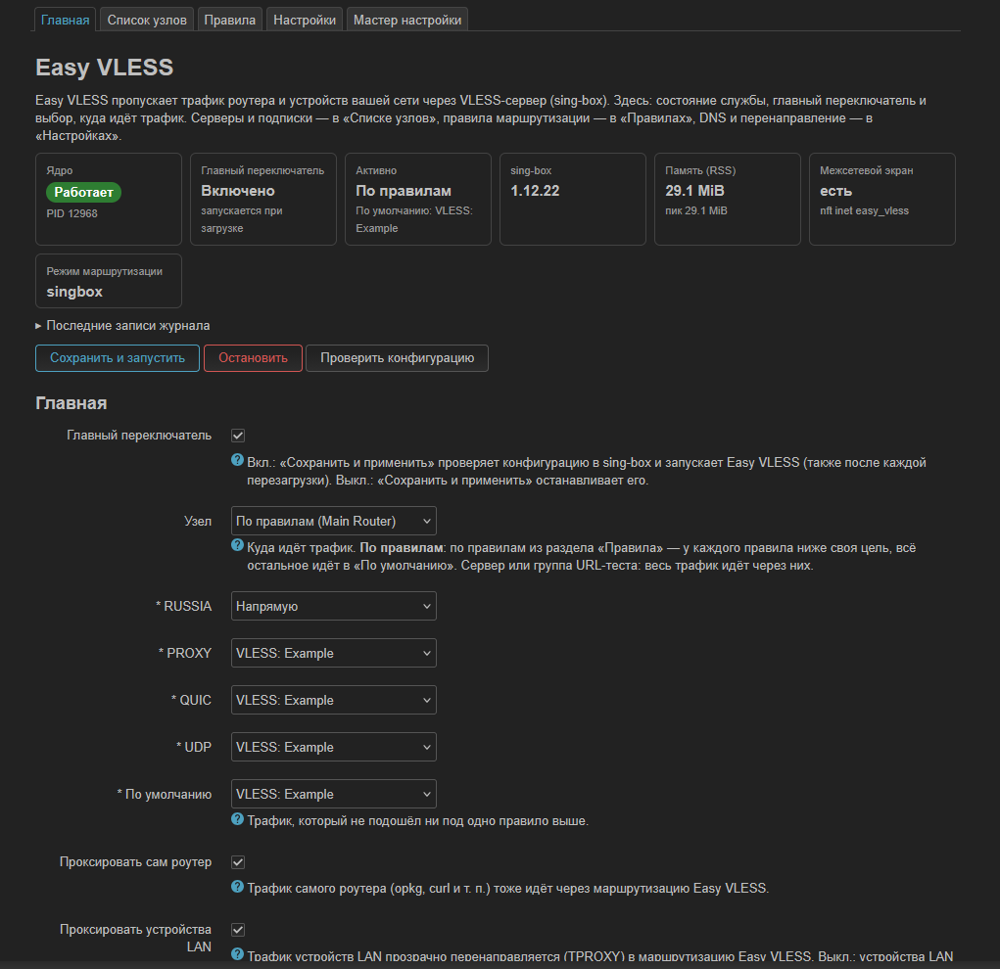

## Содержание

- [Возможности](#возможности)
- [Как это работает](#как-это-работает)
- [Требования](#требования)
- [Установка](#установка)
- [Первый запуск](#первый-запуск)
- [First Run Wizard](#first-run-wizard)
- [Главная](#главная)
- [Список узлов](#список-узлов)
- [Подписки](#подписки)
- [Правила](#правила)
- [Проверка соединения](#проверка-соединения)
- [DNS](#dns)
- [Перенаправление](#перенаправление)
- [Настройки](#настройки)
- [Обновление](#обновление)
- [Удаление](#удаление)
- [FAQ](#faq)
- [Ограничения](#ограничения)
- [Дополнительно](#дополнительно)

## Возможности

- **VLESS**: транспорт TCP, WebSocket, gRPC, HTTPUpgrade; защита TLS, Reality, uTLS; flow `xtls-rprx-vision`.
- **Серверы**: импорт ссылок `vless://` (одной или списком), ручной ввод, копирование ссылки и QR-код.
- **Подписки**: списки `vless://` (в том числе в base64), sing-box JSON, Clash YAML; импортируются VLESS-узлы. User-Agent HAPP, HWID, автоматическое обновление.
- **Раздельная маршрутизация**: правила по доменам, IP, портам, протоколу; готовые правила RUSSIA, PROXY, QUIC, UDP; у каждого правила своя цель — напрямую, сервер, группа или блокировка.
- **Проверки**: Server Test — настоящий HTTPS-запрос через сервер; URL Test и группы URL-теста с автоматическим выбором самого быстрого сервера.
- **DNS**: прямой DNS для прямых доменов, удалённый DNS через сервер для проксируемых (UDP, TCP, DoT, DoH), FakeDNS, перенаправление DNS устройств сети.
- **Мастер первой настройки**: сервер → проверка → маршрутизация → запуск, с откатом при ошибке.
- **Интерфейс LuCI** на русском и английском.

## Как это работает

```text
Устройства сети и сам роутер
        │  nftables (fw4): TPROXY перехватывает TCP/UDP-соединения
        ▼
     sing-box ── правила (домены, IP, порты) ──► цель:
        │                                         • напрямую (через провайдера)
        │                                         • VLESS-сервер или группа URL-теста
        │                                         • блокировка
        ▼
DNS: dnsmasq роутера → sing-box → прямой DNS или удалённый DNS через сервер
```

- **TPROXY** передаёт соединения в sing-box с исходным адресом назначения, поэтому правила по IP и портам работают без настройки клиентов.
- **Правила** проверяются сверху вниз; всё, что не подошло ни под одно правило, идёт в цель **По умолчанию**.
- **DNS**: пока Easy VLESS работает, dnsmasq передаёт запросы в sing-box. Домены, которые идут напрямую, разрешает прямой DNS, а проксируемые — удалённый DNS, по умолчанию через сервер.
- При остановке Easy VLESS убирает свои правила nftables, маршруты и изменения DNS: роутер работает как без него.

## Требования

| | |
|---|---|
| OpenWrt | **24.10.x** с менеджером пакетов `opkg` (OpenWrt 25.x с `apk` не поддерживается) |
| Память | **256 MB** RAM, **128 MB** flash (общий объём накопителя) |
| Свободное место | installer считает его сам; для новой установки на Cudy TR3000 v1 нужно около 32 MB |
| Архитектура | любая, для которой в официальном репозитории OpenWrt 24.10 есть `sing-box-tiny` >= 1.12; пакеты Easy VLESS — `Architecture: all` |
| Зависимости | `sing-box-tiny` и `dnsmasq-full` (dnsmasq с поддержкой nftset) из официального репозитория OpenWrt — их ставит installer |
| Сеть | интернет, правильное системное время, работающий HTTPS на роутере (см. [HTTPS на новом роутере](#https-на-новом-роутере)) |
| Конфликты | PassWall / PassWall2 должны быть остановлены |

Проверено на реальном **Cudy TR3000 v1** (OpenWrt 24.10.3, `aarch64_cortex-a53`, sing-box-tiny 1.12.22). Другие архитектуры (x86-64, ARM, MIPS) проверяются автоматическими тестами на образах OpenWrt.

## Установка

На роутере по SSH:

```sh
wget -O /tmp/install.sh https://github.com/quargelk/easy-vless/releases/download/v0.7.0/install.sh
sh /tmp/install.sh --check
sh /tmp/install.sh
```

- `--check` — безопасная предварительная проверка: версия OpenWrt, память, flash, свободное место, время, HTTPS, репозитории. Ничего не устанавливает и не меняет.
- Без `--check` installer ставит `sing-box-tiny`, при необходимости заменяет `dnsmasq` на `dnsmasq-full` (сначала спросит), затем пакеты Easy VLESS. Каждый файл релиза проверяется по `SHA256SUMS`.
- При ошибке installer останавливается и объясняет причину. Все параметры: `sh /tmp/install.sh --help`.

Релиз `v0.7.0` содержит `easy-vless_0.7.0-r1_all.ipk`, `easy-vless-sing-box_0.7.0-r1_all.ipk`, `luci-app-easy-vless_0.7.0-r1_all.ipk`, `install.sh`, `SHA256SUMS` и два необязательных пакета. Ручная установка и установка без интернета на роутере описаны в [технической документации](docs/technical.md).

### HTTPS на новом роутере

Все загрузки идут только по HTTPS с проверкой сертификата; отключать проверку (`--no-check-certificate`) не нужно. Если `wget` на свежепрошитом роутере не может скачать installer, причина обычно одна из этих:

| Сообщение `wget` | Причина | Что сделать |
|---|---|---|
| `SSL verify error: unknown error` / `Invalid SSL certificate` | **неверное системное время**: у роутеров без батарейки часов (например, Cudy TR3000) после загрузки стоит дата сборки прошивки, пока время не синхронизировано | `ntpd -n -q -p 0.openwrt.pool.ntp.org`, затем проверить `date` |
| `certificate is self-signed or not signed by a trusted CA` | нет CA-сертификатов | установить `ca-bundle` |
| `SSL support not available` | нет TLS-библиотеки для `wget` | установить `libustream-mbedtls` и `ca-bundle` |
| `Failed to send request: Operation not permitted` | не работает DNS или исходящий трафик блокирует правило nftables (например, от оставшегося PassWall) | проверить `nslookup github.com` и подключение к интернету |

Если TLS-библиотеку и `ca-bundle` скачать нельзя, их можно перенести с компьютера — см. [HTTPS без TLS-библиотеки](docs/technical.md#https-без-tls-библиотеки).

## Первый запуск

1. Установите Easy VLESS (см. [Установка](#установка)).
2. Откройте **LuCI → Службы → Easy VLESS** (Services → Easy VLESS). На ненастроенном роутере сразу откроется мастер настройки.
3. Вставьте ссылку `vless://` вашего сервера — мастер добавит его в «Список узлов».
4. Дождитесь проверки: Server Test и URL Test должны показать «ОК».
5. Выберите маршрутизацию (рекомендуемая: российские сайты напрямую, остальное через VLESS).
6. На шаге «Обзор» проверьте изменения и нажмите **Применить**.

Готово: на **Главной** видно, что Easy VLESS работает. Без мастера: добавьте сервер в «Списке узлов», на Главной выберите его в поле **Узел**, включите **Главный переключатель** и нажмите **Сохранить и запустить**.

**Язык интерфейса.** Easy VLESS использует язык LuCI. Для русского установите перевод LuCI и выберите язык в **Система → Система → Язык и тема** (русский или «авто» — язык браузера):

```sh
opkg update
opkg install luci-i18n-base-ru
```

| Русский | English |
|---|---|
| Главная | Main |
| Список узлов | Node List |
| Правила | Rule Manage |
| Настройки | Settings |
| Мастер настройки | Setup Wizard |

## First Run Wizard

Мастер настройки открывается сам, пока Easy VLESS не настроен: не выбран сервер, выключен главный переключатель и мастер ещё не завершался. На уже настроенном роутере он сам не появляется, но его всегда можно открыть вкладкой **Мастер настройки**. До последнего шага на роутере меняется только одно — добавляется сервер.

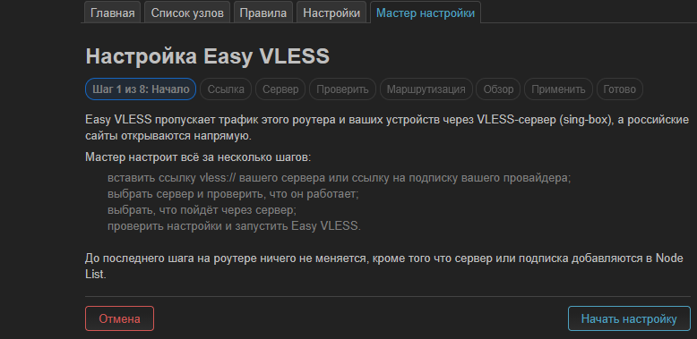

1. **Начало** — что понадобится: ссылка `vless://` от провайдера.
2. **Сервер** — вставьте одну ссылку `vless://` или выберите сервер из «Списка узлов». Мастер показывает параметры сервера и понятно объясняет ошибки: ссылка не VLESS, адрес подписки вместо ссылки сервера, неверный UUID или порт.
3. **Проверка сервера** — Server Test и URL Test через этот сервер. Если сервер не отвечает, видна причина; можно повторить проверку, вернуться или продолжить.

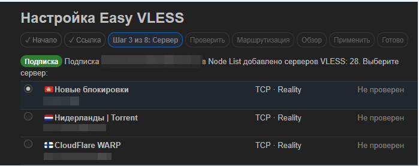

4. **Маршрутизация** — «Рекомендуется» (российские сайты напрямую, остальное через VLESS: готовые правила RUSSIA, PROXY, QUIC, UDP), «Всё через VLESS» или, на настроенном роутере, «Оставить текущую маршрутизацию».
5. **Обзор** — все изменения до применения: сервер, правила и их цели, DNS, перенаправление.

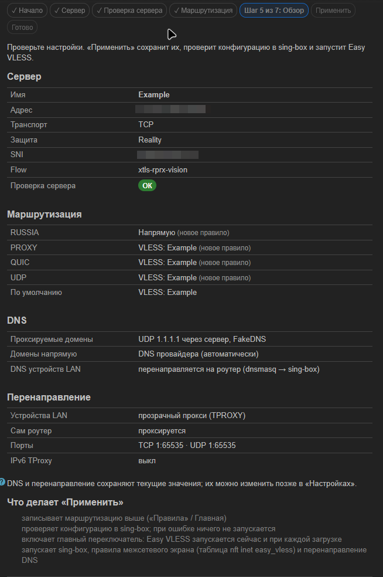

6. **Применить** — копия текущей конфигурации, сохранение, проверка в sing-box, запуск и проверка состояния службы.
7. **Готово** — итог и проверка соединения через Easy VLESS.

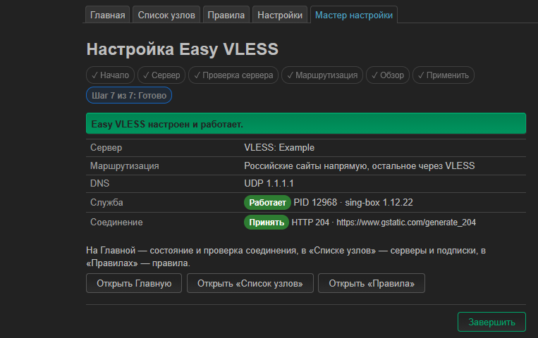

Если применить не удалось (конфигурация неверна или служба не запустилась), мастер возвращает прежнюю конфигурацию и показывает причину. Если страницу закрыли или роутер перезагрузился посреди применения, при следующем открытии мастер предложит восстановить прежнюю конфигурацию. **Отмена** удаляет сервер, добавленный в этом запуске мастера, и больше ничего не трогает.

## Главная

Состояние службы и главный выбор — куда идёт трафик.

- **Карточки состояния**: работает ли sing-box, главный переключатель, активная цель, версия sing-box, память, таблица межсетевого экрана; под ними раскрываются **Последние записи журнала**.
- **Главный переключатель**: включён — Easy VLESS запускается кнопкой «Применить» внизу страницы и после каждой перезагрузки роутера; выключен — служба останавливается.
- **Узел**:
  - VLESS-сервер или группа URL-теста — весь трафик идёт через них;
  - **По правилам (Main Router)** — трафик распределяется правилами из раздела «Правила». Под полем для каждого правила выбирается цель (напрямую, сервер, группа, блокировка или «Не используется»), а **По умолчанию** — цель для всего, что не подошло ни под одно правило.
- **Проксировать сам роутер** / **Проксировать устройства LAN** — чей трафик проходит через Easy VLESS.

Кнопки:

- **Сохранить и запустить** — сохранить, проверить конфигурацию в sing-box и (пере)запустить службу;
- **Остановить** — остановить службу и выключить главный переключатель;
- **Проверить конфигурацию** — создать конфигурацию sing-box и проверить её, ничего не запуская.

Внизу страницы кнопка **Применить** (Save & Apply) применяет изменения к службе; **Сохранить** только записывает настройки.

## Список узлов

Три раздела: **Серверы**, **Подписки по URL** и **Группы URL-теста**.

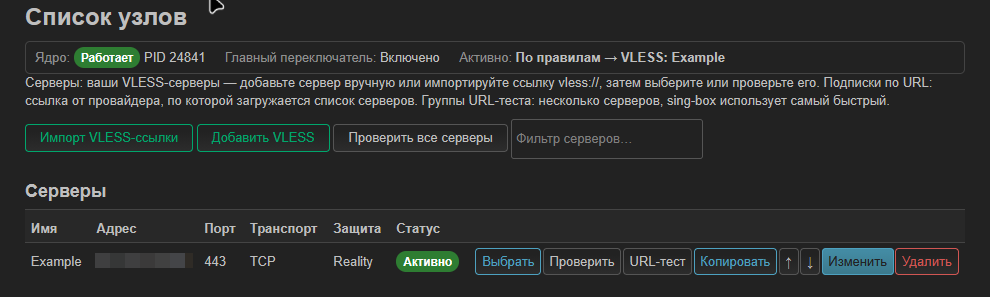

**Серверы.** **Импорт VLESS-ссылки** принимает одну или несколько ссылок `vless://`; **Добавить VLESS** — ввод параметров вручную (адрес, порт, UUID, транспорт, TLS/Reality). Для каждого сервера:

- **Выбрать** — сделать сервер основным узлом (или целью «По умолчанию», если узел — «По правилам»);
- **Проверить** — Server Test; **URL-тест** — проверка доступности `https://x.com` через сервер;
- **Копировать** — ссылка `vless://` и QR-код;
- **↑ / ↓**, **Изменить**, **Удалить**.

Столбец **Статус** показывает, используется ли сервер сейчас, и результаты последних проверок. Сервер, который где-то используется, удалить нельзя — сначала выберите другую цель. **Фильтр серверов** помогает в длинных списках из подписок.

**Группы URL-теста.** Группа объединяет несколько серверов: sing-box регулярно проверяет их (по умолчанию через `https://x.com`) и использует самый быстрый. Группу можно выбрать узлом на Главной, целью «По умолчанию» или целью правила. Пока группа используется работающей службой, под разделом видны текущие задержки серверов и кнопка **Проверить все серверы сейчас**.

## Подписки

Подписка — это ссылка от провайдера, по которой загружается список серверов. **Список узлов → Подписки по URL → Добавить подписку**: укажите имя и ссылку, сохраните и нажмите **Обновить**.

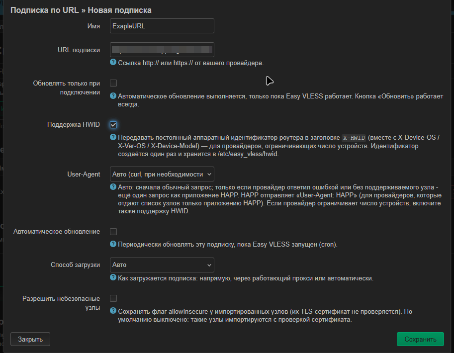

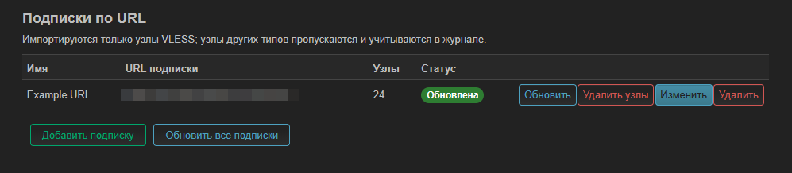

- **Обновить** загружает подписку сейчас; **Обновить все подписки** — все сразу. Окно обновления показывает формат, число импортированных и пропущенных узлов.
- Формат определяется автоматически: список `vless://` (текст или base64), sing-box JSON, Clash YAML. Импортируются только VLESS-узлы, остальные пропускаются.
- При обновлении добавленные вручную серверы не меняются, дубликаты не появляются. **Удалить узлы** удаляет узлы только этой подписки; удаление самой подписки её узлы оставляет.
- **Автоматическое обновление** — каждые 1–24 ч, пока Easy VLESS запущен.
- **Способ загрузки** — напрямую, через работающий прокси или автоматически.

**HAPP и HWID.** Некоторые провайдеры отдают список серверов только приложению HAPP или ограничивают число устройств. Для них:

- **User-Agent: HAPP** — запрос отправляется с `User-Agent: HAPP`;
- **Поддержка HWID** — добавляются заголовки `X-HWID`, `X-Device-OS`, `X-Ver-OS`, `X-Device-Model`. HWID создаётся один раз, хранится в `/etc/easy_vless/hwid` и не меняется при обновлении и перезагрузке.

Подписка всегда загружается по HTTPS с проверкой сертификата. **Разрешить небезопасные узлы** относится только к импортированным серверам (флаг allowInsecure), а не к загрузке подписки.

> Не публикуйте ссылку на подписку, UUID и HWID — ни в тексте, ни на скриншотах.

## Правила

Правило = **условия** (какой трафик ему подходит) + **цель** (куда этот трафик идёт). Правила работают, пока на Главной в поле **Узел** выбрано **По правилам**.

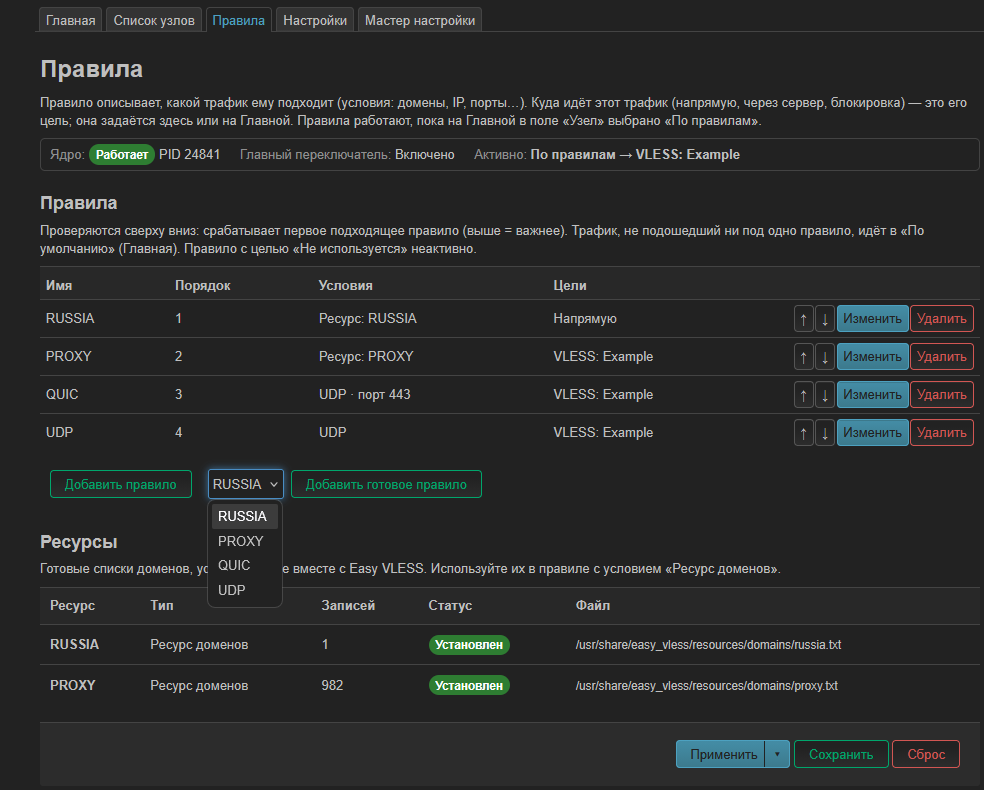

- **Порядок**: правила проверяются сверху вниз, срабатывает первое подходящее. Порядок меняется кнопками ↑ / ↓.
- **По умолчанию** (на Главной) — цель для трафика, который не подошёл ни под одно правило.
- **Готовые правила** добавляются одной кнопкой: выберите правило рядом с **Добавить правило** и нажмите **Добавить готовое правило**.
  - **RUSSIA** — российские домены (`.ru`), по умолчанию напрямую;
  - **PROXY** — список доменов, которые нужно открывать через сервер;
  - **QUIC** — UDP-порт 443 (HTTP/3);
  - **UDP** — весь остальной UDP.
- **Свои условия** — в **Изменить → + Добавить условие**: домены (`domain:`, `full:`, `regexp:`, ключевое слово), IP и подсети, порты, источник, протокол. Разные типы условий должны выполняться вместе; домены, ресурсы доменов и IP — альтернативы, достаточно любого из них.

Готовые списки доменов перечислены в разделе **Ресурсы** внизу страницы.

## Проверка соединения

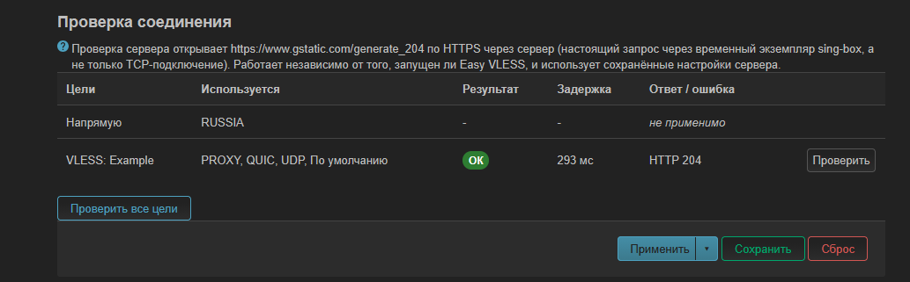

- **Server Test** («Проверить» в «Списке узлов», блок **Проверка соединения** на Главной) запускает временный экземпляр sing-box с этим сервером и открывает через него `https://www.gstatic.com/generate_204`. Это настоящий HTTPS-запрос через VLESS, а не проверка открытого порта. Работает и при остановленном Easy VLESS. При ошибке показывается причина: таймаут, ошибка TLS, нет ответа.
- **URL Test** делает такой же запрос к `https://x.com` — проверяет, что через сервер открывается реальный сайт. В группах URL-теста sing-box проверяет серверы сам и выбирает самый быстрый.

На Главной проверяются все цели, которые сейчас используются правилами и «По умолчанию».

## DNS

**Настройки → DNS.** Значения по умолчанию подходят для большинства случаев.

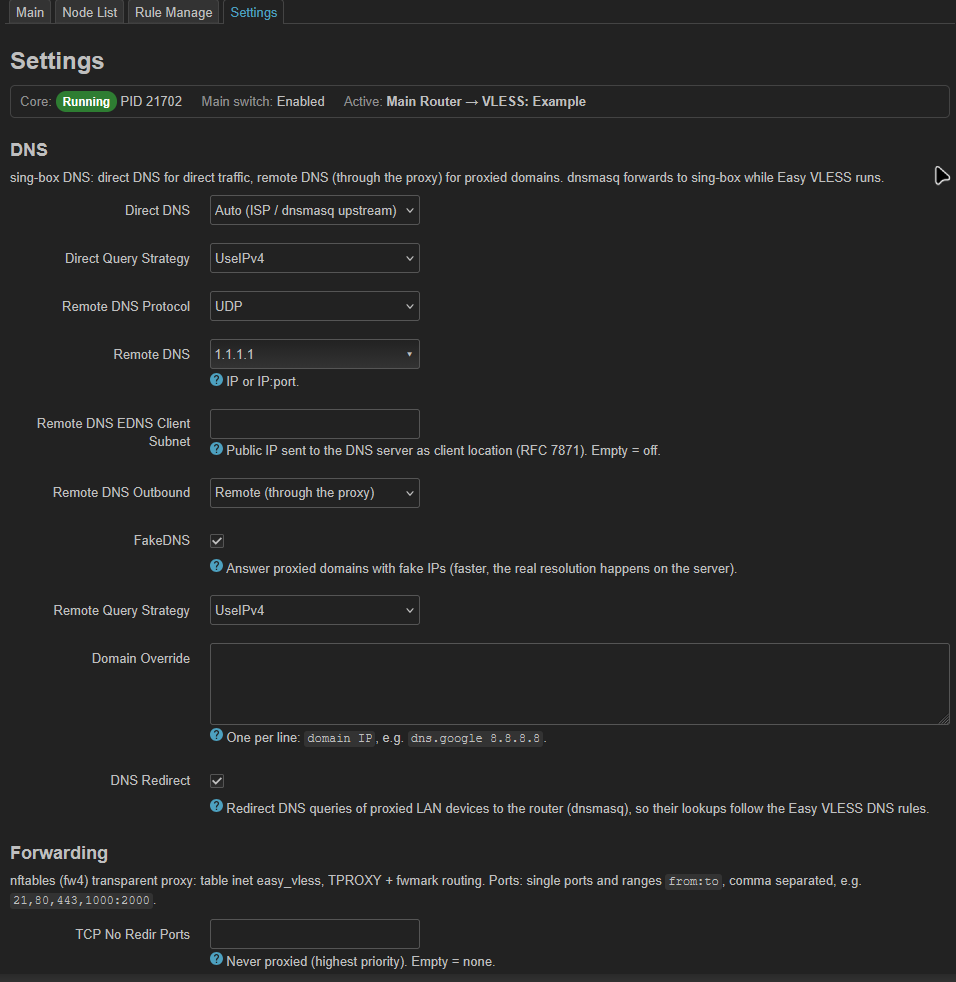

- **Прямой DNS** — для доменов, которые идут напрямую. «Авто» — DNS вашего провайдера.
- **Удалённый DNS** — для проксируемых доменов; по умолчанию запросы идут через сервер (UDP, TCP, DoT или DoH), адрес по умолчанию `1.1.1.1`.
- **FakeDNS** — проксируемые домены получают временные «поддельные» IP, а настоящее разрешение имени выполняется на сервере; соединения устанавливаются быстрее.
- **Версии IP** — какие адреса получают домены: IPv4, IPv6 или оба.
- **Статические DNS-записи** — свои соответствия «домен IP».
- **Перенаправление DNS** — DNS-запросы устройств сети принудительно идут на роутер, даже если на устройстве указан другой DNS-сервер. Так DNS-правила Easy VLESS действуют на все устройства.

## Перенаправление

**Настройки → Перенаправление** — какие соединения попадают в Easy VLESS.

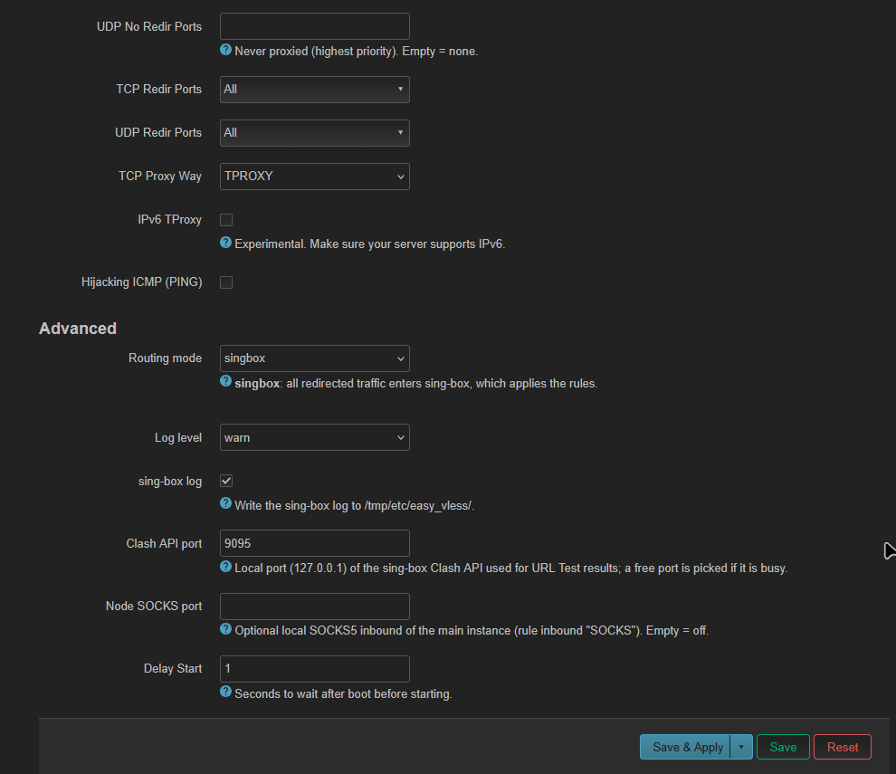

- **TCP-/UDP-порты для перенаправления** — по умолчанию все. Соединения на другие порты идут напрямую, минуя правила.
- **Порты, которые никогда не проксируются** — исключения с наивысшим приоритетом.
- **Способ перенаправления TCP** — TPROXY (по умолчанию) или REDIRECT как запасной вариант.
- **IPv6 TProxy** — перехват IPv6-соединений (экспериментально; сервер должен поддерживать IPv6).
- **Отвечать на ping локально** — ping (ICMP) через VLESS не проходит; если включено, на ping к проксируемому адресу отвечает сам роутер.

## Настройки

Раздел **Дополнительно** обычно менять не нужно.

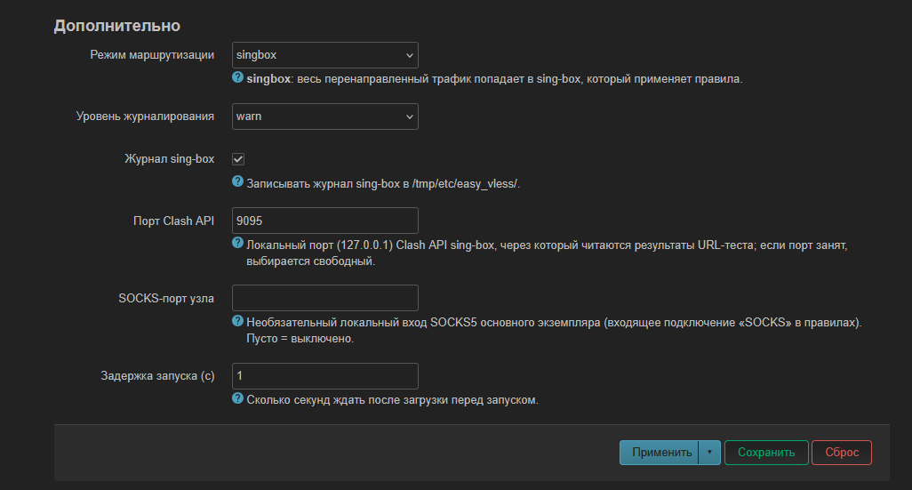

- **Уровень журналирования** и **Журнал sing-box** — подробность журнала; для диагностики — `info` или `debug`.
- **Порт Clash API** — локальный порт, через который интерфейс читает результаты групп URL-теста; если он занят, выбирается свободный.
- **SOCKS-порт узла** — необязательный локальный вход SOCKS5 (пусто — выключен).
- **Задержка запуска** — сколько секунд ждать после загрузки роутера перед запуском.

Изменения применяются кнопкой **Применить** внизу страницы (работающая служба перезапускается).

## Обновление

Новая версия ставится поверх старой тем же installer'ом — командами из раздела [Установка](#установка) со ссылкой на нужный релиз. Настройки (серверы, подписки, правила, DNS) и HWID сохраняются. Если служба была включена, installer перезапускает её с новой версией.

## Удаление

```sh
opkg remove luci-app-easy-vless easy-vless-sing-box easy-vless
```

Перед удалением служба останавливается, её правила nftables и изменения DNS убираются. `sing-box-tiny` и `dnsmasq-full` остаются в системе. Файл настроек `/etc/config/easy_vless` `opkg` оставляет: при повторной установке настройки подхватятся; если они не нужны, удалите файл вручную.

## FAQ

**Сервер не проходит Server Test.** Проверьте ссылку (адрес, порт, UUID, ключ Reality, SNI), что сервер работает и что у роутера есть интернет. «Таймаут» обычно значит, что сервер недоступен; «ошибка TLS» — что сервер отклонил соединение или неверны параметры TLS/Reality. Если Server Test проходит, а URL Test нет — сервер работает, но конкретный сайт через него недоступен.

**DNS работает не так, как ожидалось.** Проверьте, что включено **Перенаправление DNS**. Если в браузере или системе устройства включён собственный защищённый DNS (DoH, «безопасный DNS»), такие запросы идут мимо DNS роутера, и DNS-настройки Easy VLESS на них не действуют.

**Почему часть трафика идёт напрямую.** Так решают правила: RUSSIA по умолчанию направлен напрямую, а трафик, не подошедший ни под одно правило, идёт в цель «По умолчанию». Напрямую идут также порты, не входящие в «Порты для перенаправления», исключённые порты и IPv6-соединения, пока выключен IPv6 TProxy. Какая цель у какого правила — видно на Главной и в блоке «Проверка соединения».

**Где выбрать язык.** В LuCI: **Система → Система → Язык и тема**. Для русского нужен пакет `luci-i18n-base-ru` (см. [Первый запуск](#первый-запуск)).

**Easy VLESS не запускается.** Нажмите **Проверить конфигурацию** на Главной — sing-box покажет, что не так. Проверьте, что в поле **Узел** что-то выбрано. Подробности — в **Последних записях журнала**. Если в журнале есть сообщение про `dnsmasq`, нужен `dnsmasq-full` (installer предлагает замену).

## Ограничения

- Только протокол VLESS; узлы других типов в подписках пропускаются.
- Только OpenWrt 24.10.x с `opkg`.
- Нужен `dnsmasq-full` (с поддержкой nftset).
- На реальном устройстве проверен Cudy TR3000 v1; остальные архитектуры проверены автоматическими тестами.
- Подписки в формате sing-box JSON — экспериментальные; Clash YAML не покрыт автоматическими тестами.
- Маршрутизация — только через sing-box; отдельного интерфейса для Xray нет, группы URL-теста работают только с sing-box.
- Условия `geoip:` / `geosite:` (кроме встроенного `geoip:private`) требуют необязательного пакета `easy-vless-geodata`, который зависит от стороннего репозитория.
- IPv6 TProxy — экспериментально.
- Экспорта и импорта всей конфигурации нет (ссылку отдельного сервера можно скопировать).

## Дополнительно

- [Релизы](https://github.com/quargelk/easy-vless/releases) — пакеты и история версий
- [Техническая документация](docs/technical.md) — устройство, конфигурация UCI, installer, ручная установка, сборка и тесты
- [Issues](https://github.com/quargelk/easy-vless/issues) — сообщения об ошибках и вопросы

Easy VLESS основан на [PassWall2](https://github.com/Openwrt-Passwall/openwrt-passwall2) 25.5.15-1 (commit `394f3842969161ddd888187e72db4b493b3310b4`); оригинальные уведомления об авторских правах сохранены в исходных файлах. Лицензия: GPL-3.0-only, полный текст — [LICENSE](LICENSE).
