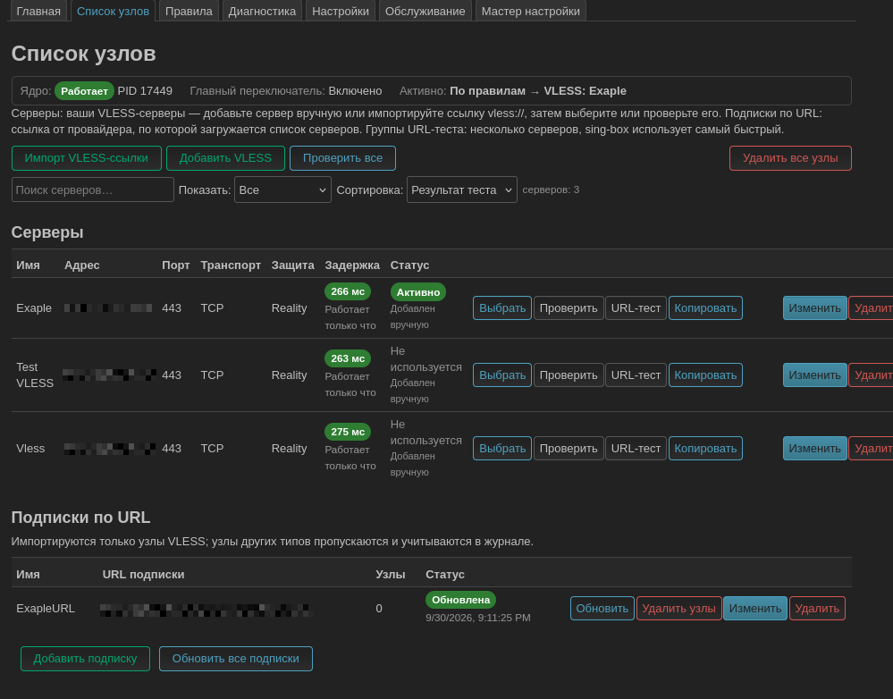
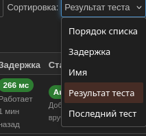
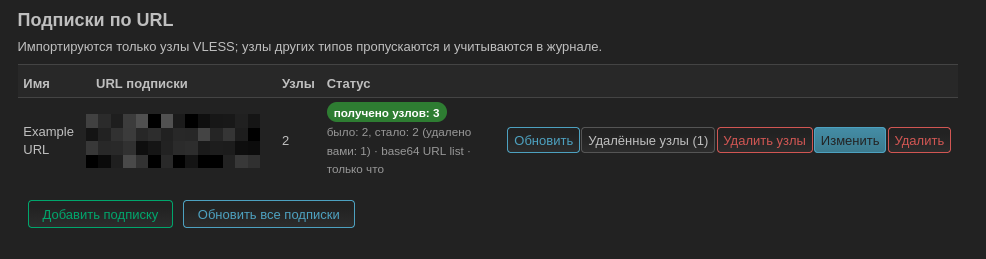
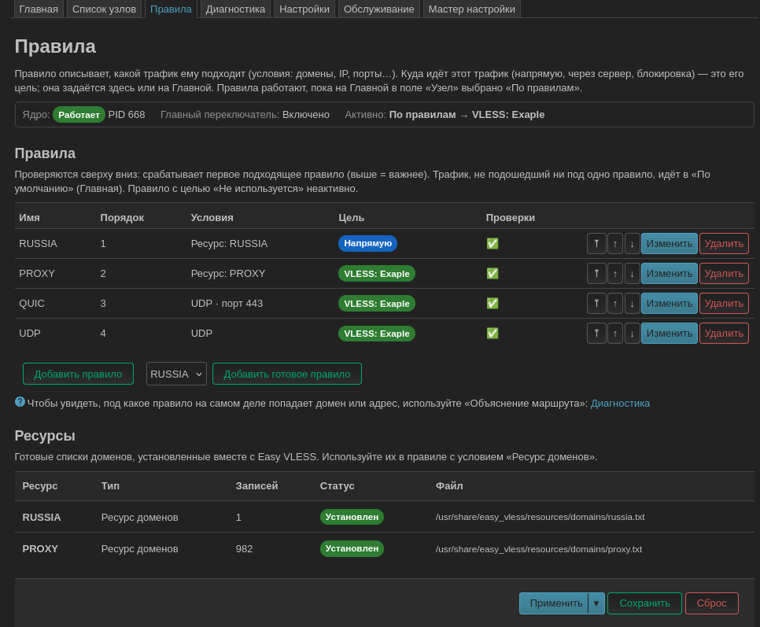
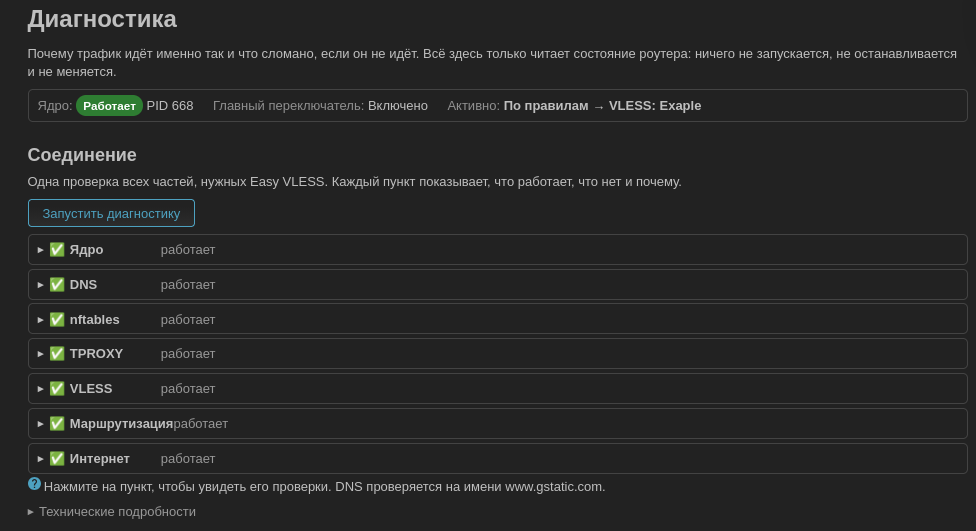
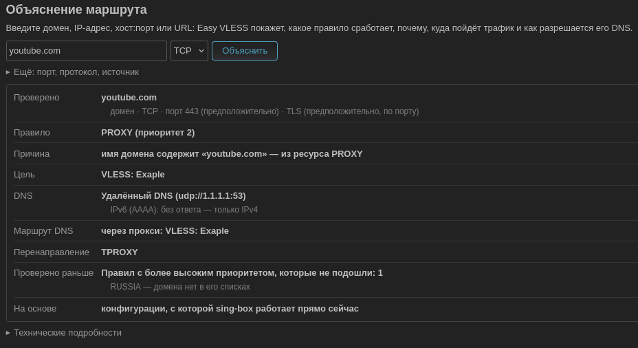
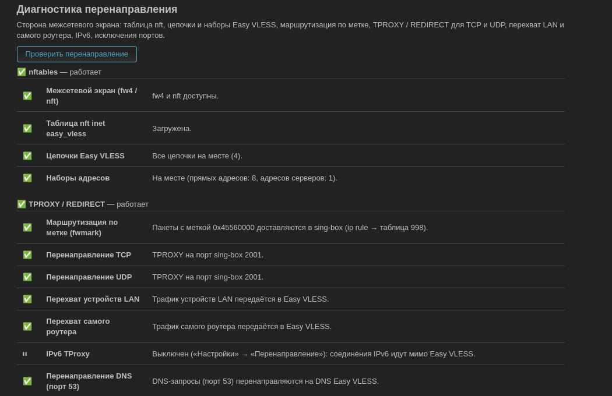
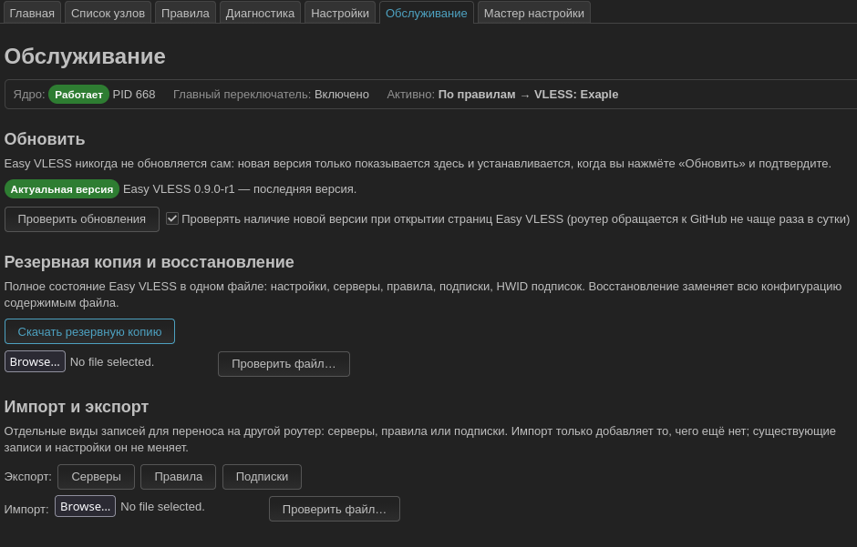

# Easy VLESS

**VLESS-клиент для роутера на OpenWrt: весь дом выходит в сеть через ваш сервер, а правила решают, какой трафик идёт через него, а какой — напрямую.**

*A VLESS client for OpenWrt routers with a LuCI web interface in Russian and English.*

**Текущая версия: 1.0.0-r1** · OpenWrt **24.10.x** (`opkg`) · Лицензия **GPL-3.0-only** · [Релизы](https://github.com/quargelk/easy-vless/releases) · [Issues](https://github.com/quargelk/easy-vless/issues)

Easy VLESS ставится на роутер и работает для всех устройств сети сразу: на телефонах, компьютерах и телевизорах ничего настраивать не нужно. Роутер сам перехватывает соединения (nftables, прозрачный прокси TPROXY) и передаёт их в [sing-box](https://sing-box.sagernet.org/), который устанавливает VLESS-соединение с сервером.

Он нужен тем, у кого уже есть VLESS-сервер или подписка провайдера и кто хочет:

- подключить к серверу всю домашнюю сеть, а не каждое устройство по отдельности;
- разделить трафик: например, российские сайты — напрямую, остальное — через сервер;
- управлять этим из веб-интерфейса роутера и видеть, почему конкретный сайт идёт именно так.


## Содержание

- [Возможности](#возможности)
- [Что нового в 1.0](#что-нового-в-10)
- [Как это работает](#как-это-работает)
- [Требования и совместимость](#требования-и-совместимость)
- [Установка](#установка)
- [Быстрый старт](#быстрый-старт)
- [Интерфейс](#интерфейс)
- [Главная: куда идёт трафик](#главная-куда-идёт-трафик)
- [Список узлов](#список-узлов)
- [Подписки](#подписки)
- [Правила и маршрутизация](#правила-и-маршрутизация)
- [DNS](#dns)
- [Перенаправление (TPROXY)](#перенаправление-tproxy)
- [Диагностика](#диагностика)
- [Обслуживание](#обслуживание)
- [Безопасность](#безопасность)
- [Решение проблем](#решение-проблем)
- [Ограничения](#ограничения)
- [Удаление](#удаление)
- [Документация и ссылки](#документация-и-ссылки)

## Возможности

| | |
|---|---|
| 🔌 **VLESS** | транспорт TCP, WebSocket, gRPC, HTTPUpgrade; TLS, Reality, uTLS; flow `xtls-rprx-vision` |
| 🖥️ **Список узлов** | серверы со статусом и задержкой, поиск, фильтры, сортировка, проверка всех серверов, выбор сервера одной кнопкой |
| 📡 **Подписки** | списки `vless://` (в том числе base64), Clash YAML, sing-box JSON; автоматическое обновление, User-Agent «Авто» / HAPP, HWID; удалённый вручную сервер обновление не возвращает |
| 🧭 **Правила** | по доменам, IP, портам, протоколу и источнику; готовые правила RUSSIA, PROXY, QUIC, UDP; у каждого правила своя цель |
| 🩺 **Диагностика** | панель соединения, объяснение маршрута (Route Explain), диагностика DNS и перенаправления — с причиной по каждому пункту |
| 🌐 **DNS** | прямой DNS для прямых доменов, удалённый DNS через сервер (UDP, TCP, DoT, DoH), FakeDNS, перенаправление DNS устройств сети |
| 🔀 **Перенаправление** | TPROXY (или REDIRECT) для устройств LAN и самого роутера, выбор портов, исключения, IPv6 TProxy |
| 🧪 **Проверки** | Server Test — настоящий HTTPS-запрос через VLESS-соединение; URL Test; группы URL-теста с автоматическим выбором самого быстрого сервера |
| 💾 **Обслуживание** | резервная копия и восстановление с отменой, импорт и экспорт серверов, правил и подписок, обновление из релиза GitHub с проверкой целостности и откатом |
| 🪄 **Мастер настройки** | от ссылки `vless://` или ссылки на подписку до работающей службы, с откатом при ошибке |
| 🌍 **Язык** | интерфейс на русском и английском |

## Что нового в 1.0

**1.0 — первый стабильный релиз.** Новых функций по сравнению с 0.9 в нём нет: проведён полный аудит проекта и исправлено найденное.

- **Безопасность и недоверенные данные.** Имя сервера из подписки или вставленной ссылки, записи импортируемого файла и настройки из восстановленной копии нигде не выполняются как команды и не вставляются в страницу как HTML. Раньше имя сервера со специальными символами могло сломать запуск службы.
- **«Сохранить» только сохраняет.** До 1.0 любое сохранение в интерфейсе незаметно перезапускало работающую службу — без проверки конфигурации и без результата. Теперь перезапуск всегда явный: «Сохранить и запустить», «Применить», «Выбрать» в «Списке узлов».
- **Честная диагностика.** Диагностика DNS больше не показывает зелёную отметку рядом с «неизвестно»: используемый DNS-сервер и маршрут к нему названы, а если определить их нельзя, это предупреждение с причиной. Проверки правил и Route Explain ничего не утверждают о том, что не могут вычислить.
- **Блокировки не остаются после сбоя.** Прерванное обновление подписки или обновление Easy VLESS больше не оставляет «занято» до перезагрузки роутера. Запрос на перезапуск, пришедший во время другого перезапуска, не теряется.
- **Надёжнее установка и обновление.** Сбой посреди установки пакетов не оставляет наполовину установленный Easy VLESS; прерванное обновление так и показывается — «прервано», а не «Установка…».
- **Подписки.** Сервер подписки проверяется при импорте (порт, управляющие символы в имени); импорт во время обновления подписки отвечает причиной, а не «добавлено 0».
- **«Выбрать сервер»** переносит на новый сервер все цели, которые вели на прежний (PROXY, QUIC, UDP и «По умолчанию»), а не только «По умолчанию» — исправление из 0.9.1.
- **Совместимость.** Каждый релиз автоматически проверяется на шести образах OpenWrt 24.10 (x86-64, ARMv8, ARMv7, MIPS) и на реальной файловой системе UBIFS; на железе — на Cudy TR3000 v1.

История версий — на странице [релизов](https://github.com/quargelk/easy-vless/releases).

## Как это работает

```text
Устройства LAN и сам роутер
            │
            ▼
   nftables / TPROXY       перехват TCP/UDP-соединений
            │
            ▼
        sing-box           конфигурацию создаёт Easy VLESS из настроек LuCI
            │
            ▼
  правила маршрутизации    условия → цель; иначе «По умолчанию»
            │
      ┌─────┴─────┐
  напрямую      VLESS      (или группа URL-теста, или блокировка)

DNS: dnsmasq роутера → sing-box → прямой DNS или удалённый DNS через сервер
```

- **Easy VLESS** — служба и интерфейс LuCI вокруг sing-box: хранит настройки, создаёт из них конфигурацию, проверяет её перед каждым запуском (`sing-box check`), включает перехват трафика и DNS.
- **Правила** проверяются сверху вниз; всё, что не подошло ни под одно правило, идёт в цель **По умолчанию**.
- **DNS**: домены, которые идут напрямую, разрешает прямой DNS, проксируемые — удалённый DNS, по умолчанию через сервер.
- При остановке Easy VLESS убирает свои правила nftables, маршруты и изменения DNS: роутер работает как без него.

## Требования и совместимость

| | |
|---|---|
| OpenWrt | **24.10.x** с менеджером пакетов `opkg` (OpenWrt 25.x с `apk` не поддерживается) |
| Память | **256 MB** RAM, **128 MB** flash (общий объём накопителя) |
| Свободное место | installer считает его сам; для новой установки на Cudy TR3000 v1 нужно около 32 MB |
| Архитектура | любая, для которой в официальном репозитории OpenWrt 24.10 есть `sing-box-tiny` >= 1.12; пакеты Easy VLESS — `Architecture: all` |
| Зависимости | `sing-box-tiny` и `dnsmasq-full` (dnsmasq с поддержкой nftset) из официального репозитория OpenWrt — их ставит installer |
| Сеть | интернет, правильное системное время, работающий HTTPS на роутере |
| Конфликты | PassWall / PassWall2 должны быть остановлены |

Проверено на реальном **Cudy TR3000 v1** (OpenWrt 24.10.3, `aarch64_cortex-a53`, sing-box-tiny 1.12.22). Остальные архитектуры проверяются автоматическими тестами на образах OpenWrt.

## Установка

На роутере по SSH:

```sh
wget -O /tmp/install.sh https://github.com/quargelk/easy-vless/releases/download/v1.0.0/install.sh
sh /tmp/install.sh --check
sh /tmp/install.sh
```

`--check` только проверяет роутер и ничего не меняет; вторая команда устанавливает. Installer — обычный читаемый shell-скрипт: его можно просмотреть перед запуском.

Что делает installer:

1. Проверяет роутер: версию OpenWrt, архитектуру, RAM, flash, свободное место, системное время, HTTPS, DNS, репозитории пакетов, fw4/nftables.
2. Ставит `sing-box-tiny` из официального репозитория OpenWrt (или оставляет установленный sing-box >= 1.12).
3. Если `dnsmasq` собран без nftset — предлагает заменить его на `dnsmasq-full`. Замена выполняется только после подтверждения; при ошибке или обрыве прежний `dnsmasq` возвращается автоматически.
4. Скачивает три пакета Easy VLESS и проверяет каждый по `SHA256SUMS` релиза. Файл, который не совпал, не устанавливается.
5. Устанавливает пакеты и включает автозапуск. Сбой посреди установки не оставляет часть Easy VLESS установленной.

До шага установки на роутере ничего не меняется. При любой ошибке installer останавливается и объясняет причину.

| Параметр | Назначение |
|---|---|
| `--check` | только проверки, ничего не устанавливать |
| `--replace-dnsmasq`, `--yes` | разрешить замену `dnsmasq` на `dnsmasq-full` без вопроса |
| `--local <dir>` | взять пакеты и `SHA256SUMS` из директории (установка без доступа к GitHub) |
| `--base-url <url>` | скачивать файлы релиза с HTTPS-зеркала |
| `--no-start` | не перезапускать службу в конце |
| `--help` | все параметры |

Релиз `v1.0.0` содержит `easy-vless_1.0.0-r1_all.ipk`, `easy-vless-sing-box_1.0.0-r1_all.ipk`, `luci-app-easy-vless_1.0.0-r1_all.ipk`, `install.sh` и `SHA256SUMS`. Ручная установка, установка без интернета на роутере и роутер без `opkg` описаны в [технической документации](docs/technical.md#installer).

**Обновление** с предыдущей версии — из интерфейса (см. [Обновление](#обновление)) или теми же командами: настройки сохраняются.

### HTTPS на новом роутере

Все загрузки идут только по HTTPS с проверкой сертификата; отключать проверку (`--no-check-certificate`) не нужно. Если `wget` на свежепрошитом роутере не может скачать installer, причина обычно одна из этих:

| Сообщение `wget` | Причина | Что сделать |
|---|---|---|
| `SSL verify error: unknown error` / `Invalid SSL certificate` | **неверное системное время**: у роутеров без батарейки часов (например, Cudy TR3000) после загрузки стоит дата сборки прошивки, пока время не синхронизировано | `ntpd -n -q -p 0.openwrt.pool.ntp.org`, затем проверить `date` |
| `certificate is self-signed or not signed by a trusted CA` | нет CA-сертификатов | установить `ca-bundle` |
| `SSL support not available` | нет TLS-библиотеки для `wget` | установить `libustream-mbedtls` и `ca-bundle` |
| `Failed to send request: Operation not permitted` | не работает DNS или исходящий трафик блокирует правило nftables (например, от оставшегося PassWall) | проверить `nslookup github.com` и подключение к интернету |

Если TLS-библиотеку и `ca-bundle` скачать нельзя, их можно перенести с компьютера — см. [HTTPS без TLS-библиотеки](docs/technical.md#https-без-tls-библиотеки).

## Быстрый старт

1. **Установите** Easy VLESS (см. [Установка](#установка)).
2. **Откройте** LuCI → **Службы → Easy VLESS**. На ненастроенном роутере сразу откроется мастер настройки.
3. **Вставьте ссылку** `vless://` вашего сервера или ссылку на подписку провайдера — мастер сам определит, что это.
4. **Выберите сервер** и дождитесь проверки: «Проверка сервера» и «URL-тест» должны показать «ОК».
5. **Выберите маршрутизацию**: рекомендуемая — российские сайты напрямую, остальное через VLESS.
6. **Примените**: на шаге «Обзор» проверьте изменения и нажмите **Применить**. Мастер сохранит копию прежней конфигурации, проверит новую в sing-box и запустит службу; если что-то не удалось, он вернёт прежнюю конфигурацию и покажет причину.
7. **Проверьте**: на Главной служба «Работает»; на странице **Диагностика** нажмите **Запустить диагностику** — все пункты должны быть «работает».

Без мастера: добавьте сервер в «Списке узлов», на Главной выберите его в поле **Узел**, включите **Главный переключатель** и нажмите **Сохранить и запустить**.

<details>
<summary><b>Мастер настройки по шагам (скриншоты)</b></summary>

```text
Начало → Ссылка → Сервер → Проверить → Маршрутизация → Обзор → Применить → Готово
```

Мастер открывается сам, пока Easy VLESS не настроен; позже его можно открыть вкладкой **Мастер настройки**. До последнего шага на роутере меняется только одно — в «Список узлов» добавляется сервер или подписка.

**Начало.** Что мастер сделает и что понадобится.


**Ссылка.** `vless://…` — один сервер; `https://…` — подписка: роутер загружает её и ищет VLESS-серверы. В параметрах подписки можно включить отправку HWID и выбрать User-Agent.


**Сервер.** Для подписки — список её серверов; выберите один. **Проверить все** проверяет их по очереди.


**Проверка.** Server Test, затем URL Test — настоящие HTTPS-запросы через выбранный сервер. При ошибке показывается причина; проверку можно повторить, выбрать другой сервер или продолжить всё равно.


**Маршрутизация.** Рекомендуемая схема (RUSSIA — напрямую; PROXY, QUIC, UDP и «По умолчанию» — через сервер), «Всё через VLESS» или текущая маршрутизация.


**Обзор.** Всё, что будет применено: сервер и результаты проверок, правила и цели, DNS, перенаправление.


**Готово.** Итог и проверка соединения через Easy VLESS.


**Отмена** удаляет только сервер или подписку, добавленные в этом запуске мастера. Если страницу закрыли или роутер перезагрузился посреди применения, при следующем открытии мастер предложит восстановить прежнюю конфигурацию.

</details>

## Интерфейс

| Страница | English | Что на ней |
|---|---|---|
| Главная | Main | состояние службы, главный переключатель, узел и цели правил, запуск и остановка |
| Список узлов | Node List | серверы, подписки, группы URL-теста, проверки |
| Правила | Rule Manage | правила маршрутизации и их проверки |
| Диагностика | Diagnostics | соединение, Route Explain, DNS, перенаправление |
| Настройки | Settings | DNS, перенаправление, дополнительные параметры |
| Обслуживание | Maintenance | обновление, резервная копия, импорт и экспорт |
| Мастер настройки | Setup Wizard | первая настройка |

Easy VLESS использует язык LuCI. Для русского установите перевод LuCI и выберите язык в **Система → Система → Язык и тема**:

```sh
opkg update
opkg install luci-i18n-base-ru
```

Журнал службы и подробности ошибок, которые приходят с роутера, остаются на английском.

## Главная: куда идёт трафик

Главная показывает состояние службы и главный выбор — поле **Узел**:

- **VLESS-сервер или группа URL-теста** — весь трафик идёт через них;
- **По правилам (Main Router)** — трафик распределяют правила. У каждого правила на Главной своя **цель** (target): «Напрямую», сервер, группа URL-теста, «Блокировать» или «Не используется». **По умолчанию** — цель для всего, что не подошло ни под одно правило.

**Проксировать сам роутер** и **Проксировать устройства LAN** определяют, чей трафик проходит через Easy VLESS.

### Сохранить и применить

| Кнопка | Что делает |
|---|---|
| **Сохранить** | только записывает настройки; работающая служба не меняется |
| **Применить** | сохраняет, проверяет конфигурацию в sing-box и перезапускает службу (при выключенном главном переключателе — останавливает) |
| **Сохранить и запустить** | то же и включает главный переключатель |
| **Остановить** | останавливает службу и выключает главный переключатель |
| **Проверить конфигурацию** | создаёт конфигурацию sing-box и проверяет её, ничего не запуская |

Неверная конфигурация не запускается: сетевые настройки роутера при этом не меняются, а причина показывается на странице. Если служба не поднялась, запуск откатывается.

## Список узлов

Три раздела: **Серверы** (добавленные вручную и из подписок), **Подписки по URL** и **Группы URL-теста**.



**Добавить сервер** можно ссылкой (**Импорт VLESS-ссылки**, одна или несколько `vless://`) или вручную (**Добавить VLESS**). **Копировать** показывает ссылку `vless://` сервера и QR-код.

У каждого сервера два столбца состояния:

- **Задержка** — результат последнего Server Test: миллисекунды и «Работает», «Ошибка» с причиной в подсказке, «Проверка…» / «В очереди» или «Не проверен»;
- **Статус** — используется ли сервер («Активно», «Выбран (остановлен)», «Используется: N», «Не используется»), результат URL Test и источник: подписка или «Добавлен вручную».

**Поиск, фильтры и сортировка** (по порядку списка, задержке, имени, результату теста, времени проверки) меняют только отображение; сохранённый порядок серверов остаётся прежним, а выбор запоминается в браузере. При сортировке по задержке серверы с ошибкой и непроверенные идут после работающих — отсутствие результата не считается «0 мс».



### Выбрать сервер

**Выбрать** (Use Server) направляет проксируемый трафик на этот сервер или группу URL-теста:

- если на Главной узлом выбран сервер или группа — он заменяется на новый;
- если узел — **По правилам**, новый сервер получают все цели, которые вели на прежний выбранный: обычно PROXY, QUIC, UDP и «По умолчанию».

Не меняются цели «Напрямую», «Блокировать», «Цель по умолчанию», «Не используется» и правила, которые вы сами направили на другой сервер. После нажатия показывается, какие записи изменены; если служба работает, конфигурация проверяется и служба перезапускается с ней.

### Проверки серверов

| | Server Test («Проверить») | URL Test («URL-тест») |
|---|---|---|
| Адрес | `https://www.gstatic.com/generate_204` | `https://x.com` |
| Что проверяет | работает ли VLESS-соединение с сервером | открывается ли через сервер реальный сайт |
| Успех | ответ 200 или 204 | любой HTTP-ответ |

Server Test запускает временный экземпляр sing-box с этим сервером и выполняет через него настоящий HTTPS-запрос — это не ping и не проверка открытого порта. Работает и при остановленном Easy VLESS.

**Проверить все** проверяет серверы по очереди: видны прогресс и **Отмена**. Роутер выполняет проверки строго по одной и пропускает вперёд запуск и остановку службы. Результаты хранятся в памяти роутера до перезагрузки.

### Удалить все узлы

Кнопка сначала показывает, что произойдёт, и удаляет только после подтверждения:

- удаляются все серверы; подписки, правила и настройки остаются, серверы подписок вернутся при следующем обновлении;
- «По умолчанию» становится «Напрямую», а правила, которые вели на удалённые серверы, получают «Цель по умолчанию»;
- группа URL-теста без серверов удаляется;
- если основным узлом был сервер, служба останавливается.

Сломанных ссылок на несуществующие серверы после удаления не остаётся. Один сервер, который где-то используется, удалить нельзя — сначала выберите другую цель.

### Группы URL-теста

Группа объединяет несколько серверов: sing-box регулярно проверяет их и использует самый быстрый. Группу можно выбрать узлом, целью правила или «По умолчанию». Пока группа используется работающей службой, под разделом видны текущие задержки её серверов.

## Подписки

Подписка — ссылка от провайдера, по которой загружается список серверов. Добавьте её в мастере или в **Список узлов → Подписки по URL → Добавить подписку** и нажмите **Обновить**.


**Форматы** определяются автоматически: список ссылок `vless://` (текстом или в base64), Clash YAML, sing-box JSON. Импортируются только VLESS-серверы.

**Обновление:**

- результат виден в столбце **Статус**: сколько серверов получено, сколько новых, обновлённых, исчезнувших — или понятная причина ошибки;
- если подписка не загрузилась, пришёл пустой ответ или в нём нет VLESS-серверов, **существующие серверы сохраняются**;
- сервер определяется по адресу, порту, UUID и параметрам транспорта, а не по имени или месту в списке: если провайдер переставил или переименовал серверы, прежний сервер остаётся тем же — вместе с целями правил, группами и результатом проверки;
- серверы, добавленные вручную, обновление не трогает; дубликаты не появляются;
- **Автоматическое обновление** — каждые 1–24 ч, пока Easy VLESS запущен.

### Удалённые серверы подписки

Сервер подписки, удалённый кнопкой **Удалить** в его строке, следующие обновления не вернут. Подписка запоминает такие серверы, и в её строке появляется кнопка **Удалённые узлы (N)**: там можно восстановить один сервер или все и затем нажать **Обновить**.



Список удалённых хранится в настройках подписки и переживает перезагрузку и обновление прошивки. Неудачное обновление его не меняет. **Удалить узлы** (у подписки) и **Удалить все узлы** серверы как удалённые вручную не помечают — они вернутся при следующем обновлении.

### User-Agent, HAPP и HWID

Некоторые провайдеры отдают список серверов только приложению HAPP или ограничивают число устройств.

- **User-Agent «Авто»** (по умолчанию): обычный запрос; если провайдер ответил ошибкой HTTP 4xx или без VLESS-серверов — один повторный запрос с `User-Agent: HAPP`. Также доступны «По умолчанию (curl)», «HAPP» и свой User-Agent.
- **Поддержка HWID** добавляет к запросу заголовки `X-HWID`, `X-Device-OS`, `X-Ver-OS`, `X-Device-Model`. HWID создаётся один раз и не меняется при обновлении и перезагрузке.

Подписка всегда загружается с проверкой сертификата HTTPS.

## Правила и маршрутизация

Правило = **условия** (какой трафик ему подходит) + **цель** (куда он идёт). Правила работают, пока на Главной в поле **Узел** выбрано **По правилам**.



- **Порядок = приоритет.** Правила проверяются сверху вниз, срабатывает первое подходящее. Порядок меняют кнопки ↑ / ↓, кнопка ⤒ делает правило первым.
- **Условия:** домены (`domain:`, `full:`, `regexp:`, ключевое слово), готовые ресурсы доменов, IP и подсети, порты, сеть (TCP / UDP), протокол, источник. Разные типы условий должны выполняться вместе; домены, ресурсы доменов и IP — альтернативы, достаточно любого.
- **Цель** выбирается в правиле или на Главной: «Напрямую», сервер, группа URL-теста, «Блокировать», «Цель по умолчанию» (следует за «По умолчанию») или «Не используется».

| Готовое правило | Условия | Цель |
|---|---|---|
| **RUSSIA** | российские домены | напрямую |
| **PROXY** | список доменов, которые нужно открывать через сервер | выбранный сервер |
| **QUIC** | UDP, порт 443 (HTTP/3) | выбранный сервер |
| **UDP** | весь остальной UDP | выбранный сервер |

Готовое правило добавляется одной кнопкой: выберите его рядом с **Добавить правило** и нажмите **Добавить готовое правило**.

### Проверки правил

Столбец **Проверки** и сводка над таблицей показывают проблемы, которые следуют из самих настроек:

| Сообщение | Что это значит |
|---|---|
| Никогда не сработает | правило выше уже забирает весь трафик этого правила, а цель у него другая |
| Ни на что не влияет | то же, но цель совпадает — правило лишнее |
| Частично перекрыто | часть доменов или адресов правила есть в правиле выше с другой целью |
| Несовместимые условия | например, QUIC вместе с сетью TCP; такое правило редактор не сохранит |
| Цель или ресурс отсутствуют | правило указывает на удалённый сервер, пустую группу или неустановленный ресурс доменов |

Сообщается только то, что можно доказать по настройкам: обычное пересечение правил ошибкой не считается. Под какое правило на самом деле попадает конкретный сайт, показывает [Route Explain](#объяснение-маршрута-route-explain).

## DNS

**Настройки → DNS.** Значения по умолчанию подходят для большинства случаев.


| Поле | Что задаёт |
|---|---|
| **Прямой DNS** | DNS для доменов, которые идут напрямую: «Авто» (DNS провайдера) или свой сервер |
| **Удалённый DNS** и его протокол | DNS для проксируемых доменов: UDP, TCP, DoT или DoH |
| **Маршрут удалённого DNS** | через сервер (по умолчанию) или напрямую |
| **FakeDNS** | проксируемые домены получают временные подставные IP, а имя разрешается на сервере: соединения устанавливаются быстрее |
| **Версии IP** | IPv4 и IPv6, только IPv4 (по умолчанию для удалённого DNS) или только IPv6 |
| **EDNS Client Subnet** | необязательный публичный IP, который передаётся удалённому DNS как местоположение клиента |
| **Статические DNS-записи** | свои соответствия `домен IP` |
| **Перенаправление DNS** | DNS-запросы устройств LAN идут на роутер, даже если на устройстве указан другой DNS-сервер |

Как разрешается конкретный домен при текущих настройках, показывает [диагностика DNS](#диагностика-dns).

## Перенаправление (TPROXY)

**Настройки → Перенаправление** — какие соединения попадают в Easy VLESS.


- **Порты для перенаправления** (TCP и UDP) — по умолчанию все. Соединения на другие порты идут напрямую, минуя правила.
- **Порты, которые никогда не проксируются** — исключения с наивысшим приоритетом.
- **Способ перенаправления TCP** — TPROXY (по умолчанию) или REDIRECT как запасной вариант. UDP всегда идёт через TPROXY.
- **IPv6 TProxy** — перехват IPv6-соединений (экспериментально).
- **Отвечать на ping локально** — ping через VLESS не проходит; если включено, на ping к проксируемому адресу отвечает сам роутер.

Порты задаются через запятую, диапазоны — `от:до`, например `21,80,443,1000:2000`.

В **Настройки → Дополнительно** — уровень журнала, порт Clash API, локальный SOCKS-порт и задержка запуска; обычно их менять не нужно.


## Диагностика

Диагностика отвечает на два вопроса: **почему трафик идёт именно так** и **что сломано, если он не идёт**. Она только читает состояние роутера: ничего не запускает, не останавливает и не меняет. То, что определить нельзя, показывается как «не проверено» или «не наверняка» с причиной — а не как успех.

### Проверка соединения на Главной

Блок **Проверка соединения** внизу Главной показывает серверы, которые сейчас используются как цели, и результат их Server Test. **Проверить все цели** проверяет их разом — это самый быстрый способ убедиться, что серверы отвечают.


### Соединение

На странице **Диагностика** кнопка **Запустить диагностику** проверяет все части, нужные Easy VLESS, и по каждой показывает: работает, работает частично, не работает, выключено — и причину.



| Пункт | Что проверяется |
|---|---|
| **Ядро** | установлен ли sing-box, выполнены ли требования для запуска, работает ли служба |
| **DNS** | разрешение имени тем же путём, что и у устройств сети; доступность прямого и удалённого DNS |
| **nftables** | таблица, цепочки и наборы адресов Easy VLESS |
| **TPROXY** | маршрутизация по метке, перенаправление TCP и UDP, перехват LAN и самого роутера |
| **VLESS** | выбранный узел и результат его последнего Server Test |
| **Маршрутизация** | все ли цели указывают на существующие узлы, применены ли сохранённые правила |
| **Интернет** | HTTPS-запрос с роутера |

Нажмите на пункт, чтобы увидеть его проверки и что делать.

### Объяснение маршрута (Route Explain)

Введите домен, IP-адрес, `хост:порт` или URL и нажмите **Объяснить** — Easy VLESS покажет, что произойдёт с таким соединением:



- **Правило** и его приоритет — или «ни одно правило не подошло: По умолчанию»;
- **Причина** — какая запись правила подошла и откуда она;
- **Цель** — сервер, группа URL-теста (с сервером, который используется сейчас), «Напрямую» или «Блокировать»;
- **DNS** — какой DNS ответит на это имя и каким маршрутом;
- **Перенаправление** — TPROXY или REDIRECT, либо причина, по которой соединение вообще не попадает в Easy VLESS;
- **Проверено раньше** — правила с более высоким приоритетом и почему они не подошли.

Объяснение строится по той конфигурации sing-box, с которой служба работает сейчас (если она остановлена — по той, что дадут сохранённые настройки). То, что вычислить нельзя — правило со списком `geosite:` / `geoip:`, слишком сложное регулярное выражение, условие, которое Easy VLESS не вычисляет, — показывается как **«Не наверняка»** с причиной, а не угадывается.

### Диагностика DNS

Разрешает один домен тем же путём, что и устройство сети, и показывает: результат, какой DNS отвечает (прямой, удалённый или FakeDNS) и каким маршрутом, режим IPv4 / IPv6, доступность прямого и удалённого DNS с задержкой, перехват DNS устройств LAN.

Обнаруживаются: недоступный DNS-сервер, неработающее перенаправление DNS, конфликт FakeDNS (пришёл настоящий адрес вместо подставного или наоборот), несоответствие режима IP. Шифрованный DNS на самом устройстве (DoH, «Частный DNS») роутер увидеть не может — диагностика так и сообщает.

### Диагностика перенаправления

Проверяет сторону межсетевого экрана и по каждому пункту называет причину.



- **nftables** — доступны ли `fw4` и `nft`, загружена ли таблица Easy VLESS, на месте ли цепочки и наборы адресов;
- **TPROXY / REDIRECT** — маршрутизация по метке, перенаправление TCP и UDP на порт sing-box, перехват устройств LAN и самого роутера, IPv6, перенаправление DNS, исключения портов.

«Работает частично» означает, что, например, TCP перенаправляется, а UDP нет. Выключенное в настройках показывается как «выключено», а не как ошибка. Если служба остановлена, а её правила остались от прошлого запуска, диагностика это отметит.

## Обслуживание



### Обновление

Easy VLESS никогда не обновляется сам. Когда выходит новая версия, на Главной и в «Обслуживании» появляется сообщение; установка начинается только после нажатия **Обновить** и подтверждения. Наличие новой версии роутер проверяет при открытии страниц Easy VLESS, не чаще раза в сутки (отключается флажком); **Проверить обновления** спрашивает GitHub сразу.

После подтверждения:

1. файлы релиза загружаются по HTTPS и проверяются по `SHA256SUMS`; файл, который не подошёл, не устанавливается;
2. роутер проверяется на совместимость с новой версией;
3. сохраняется копия конфигурации и загружаются пакеты установленной версии — для отката;
4. новая версия устанавливается и проверяется: версии пакетов и то, что она принимает сохранённую конфигурацию;
5. служба перезапускается, если главный переключатель включён.

Если установка или проверка после неё не удалась, возвращаются прежние пакеты и конфигурация, а причина показывается на странице. Настройки и HWID при обновлении сохраняются; понижение версии не выполняется.

### Резервная копия и восстановление

**Резервная копия** — полное состояние Easy VLESS в одном файле: настройки, серверы, правила, подписки, HWID.

- **Проверить файл…** проверяет копию целиком (формат, контрольную сумму, корректность конфигурации) и показывает, что в ней. Конфигурация при этом не меняется.
- **Восстановить эту копию** заменяет всю конфигурацию. Перед этим текущая сохраняется, и **Отменить последнее восстановление** возвращает её.
- Повреждённый или изменённый файл отклоняется с причиной.

### Импорт и экспорт

**Экспорт** сохраняет записи одного вида — серверы, правила или подписки — для переноса на другой роутер. Это другой формат: файл экспорта нельзя восстановить как копию, а копию — импортировать.

- **Импорт только добавляет** записи; существующие он не меняет и не удаляет.
- Файл сначала проверяется: видно, сколько записей будет добавлено и какие пропущены (уже существуют, повторяются, содержат некорректное значение). Добавление — отдельной кнопкой.
- Правило переносится с целью, только если это «Напрямую», «Блокировать» или «Цель по умолчанию»: серверы другого роутера в правило не входят.

Группы URL-теста и настройки переносятся только резервной копией.

## Безопасность

**Что делает Easy VLESS:**

- **Загрузки** (installer, пакеты, подписки, обновление) идут только по HTTPS с проверкой сертификата.
- **Целостность**: пакеты устанавливаются только после проверки по `SHA256SUMS` релиза — и installer'ом, и обновлением из интерфейса.
- **Недоверенные данные**: содержимое подписки, импортируемого файла и резервной копии проверяется до изменения конфигурации; из импортируемых записей берутся только известные параметры. Значения оттуда никогда не выполняются как команды и не вставляются в страницу как HTML.
- **Откат**: неудачный запуск, применение в мастере, восстановление копии и обновление возвращают прежнее состояние.
- **Одна операция за раз**: запуск, остановка, проверки, обновление подписок и обновление пакетов не выполняются одновременно; второе действие ждёт или получает ответ «занято».
- **Диагностика** ничего не меняет на роутере.

**Что зависит от вас:**

- Файлы резервной копии и экспорта содержат секреты: UUID серверов, ключи Reality, ссылки подписок, HWID. Храните их как пароли.
- Не публикуйте ссылку на подписку, UUID и HWID — ни в тексте, ни на скриншотах.
- Восстанавливайте только свои резервные копии: копия заменяет всю конфигурацию и может указать на чужие серверы.
- Доступ к Easy VLESS — это доступ к LuCI: используйте надёжный пароль роутера и не открывайте веб-интерфейс в интернет.

`SHA256SUMS` берётся из того же релиза, что и пакеты: это проверка целостности и принадлежности файлов релизу, а не цифровая подпись автора.

## Решение проблем

Начните со страницы **Диагностика → Запустить диагностику**: она покажет, какая часть не работает и почему.

| Проблема | Что делать |
|---|---|
| **Installer отказывается устанавливать** | `sh /tmp/install.sh --check` назовёт невыполненное требование: версия OpenWrt, память, свободное место, время, HTTPS, репозитории |
| **`wget` не скачивает installer** | почти всегда неверное системное время или нет CA-сертификатов — см. [HTTPS на новом роутере](#https-на-новом-роутере) |
| **Служба не запускается** | **Проверить конфигурацию** на Главной покажет ответ sing-box; пункт «Ядро» в диагностике — выполнены ли требования. Убедитесь, что в поле **Узел** что-то выбрано. Сообщение про `dnsmasq` в журнале значит, что нужен `dnsmasq-full` |
| **Служба работает, сайты не открываются** | панель «Соединение»: пункты VLESS и «Интернет» покажут, отвечает ли сервер; затем Server Test сервера в «Списке узлов» |
| **Сервер не проходит Server Test** | проверьте адрес, порт, UUID, ключ Reality и SNI. «Таймаут» — сервер недоступен; «ошибка TLS» — сервер отклонил соединение или неверны параметры TLS / Reality |
| **Server Test проходит, URL Test — нет** | сервер работает, но `https://x.com` через него не открывается; Easy VLESS можно запускать |
| **Сайт идёт не туда, куда ожидалось** | [Route Explain](#объяснение-маршрута-route-explain) покажет сработавшее правило и причину. Напрямую идут также порты вне «Портов для перенаправления», исключённые порты и IPv6 при выключенном IPv6 TProxy |
| **Правило не срабатывает** | столбец **Проверки** на странице «Правила»: правило может быть перекрыто правилом выше |
| **DNS работает не так** | [диагностика DNS](#диагностика-dns) для проблемного домена; проверьте, что включено **Перенаправление DNS**. Защищённый DNS в браузере или системе устройства идёт мимо роутера |
| **TPROXY «работает частично» или не работает** | [диагностика перенаправления](#диагностика-перенаправления) назовёт отсутствующее правило; обычно помогает **Применить** на Главной |
| **Подписка не обновляется** | причина — в столбце **Статус**. HTTP 4xx или «нет поддерживаемых узлов» — попробуйте User-Agent «Авто» или HAPP и **Поддержку HWID**; «TLS-сертификат не прошёл проверку» — проверьте время роутера и пакет `ca-bundle`. Существующие серверы при ошибке сохраняются |
| **Удалённый сервер подписки вернулся или не возвращается** | сервер, удалённый кнопкой **Удалить** в его строке, возвращает только **Удалённые узлы** в строке подписки; серверы, удалённые через **Удалить узлы** / **Удалить все узлы**, вернутся при следующем обновлении |
| **«Занято другой операцией»** | идёт запуск, остановка, проверка или обновление подписки — повторите через несколько секунд |
| **Изменения не действуют** | **Сохранить** только записывает настройки; чтобы применить их к работающей службе, нажмите **Применить** |
| **Обновление не устанавливается** | причина показана в «Обслуживании»; журнал — `/tmp/log/easy_vless_update.log` на роутере |
| **Интерфейс на английском** | установите `luci-i18n-base-ru` и выберите язык в LuCI |

Журнал службы — в блоке **Последние записи журнала** на Главной.

## Ограничения

- Только протокол VLESS; серверы других типов в подписках пропускаются.
- Только OpenWrt 24.10.x с `opkg`; нужен `dnsmasq-full`.
- На реальном устройстве проверен Cudy TR3000 v1; остальные архитектуры — автоматическими тестами.
- Маршрутизация работает только через sing-box.
- Условия `geoip:` / `geosite:` (кроме встроенного `geoip:private`) требуют необязательного пакета `easy-vless-geodata`, который зависит от стороннего репозитория; Route Explain такие списки не читает.
- IPv6 TProxy и подписки в формате sing-box JSON — экспериментальные.
- Результаты Server Test и URL Test хранятся до перезагрузки роутера.
- Диагностика не видит шифрованный DNS, включённый на самом устройстве.
- Цифровой подписи релизов нет: целостность проверяется по `SHA256SUMS`.

## Удаление

```sh
opkg remove luci-app-easy-vless easy-vless-sing-box easy-vless
```

Перед удалением служба останавливается, её правила nftables и изменения DNS убираются. `sing-box-tiny` и `dnsmasq-full` остаются в системе. Файл настроек `/etc/config/easy_vless` и каталог `/etc/easy_vless` (HWID, копии конфигурации) тоже остаются: при повторной установке настройки подхватятся; если они не нужны, удалите их вручную.

## Документация и ссылки

- [Техническая документация](docs/technical.md) — устройство, конфигурация UCI, очередь проверок и блокировки, подписки, installer, ручная и офлайн-установка, пакеты, тесты и сборка
- [Релизы](https://github.com/quargelk/easy-vless/releases) — installer, пакеты и история версий
- [Issues](https://github.com/quargelk/easy-vless/issues) — сообщения об ошибках и вопросы
- [Pull requests](https://github.com/quargelk/easy-vless/pulls) — предложения изменений

Часть runtime Easy VLESS основана на коде [PassWall2](https://github.com/Openwrt-Passwall/openwrt-passwall2) (версия 25.5.15-1); оригинальные уведомления об авторских правах сохранены в исходных файлах. Лицензия: GPL-3.0-only, полный текст — [LICENSE](LICENSE).
