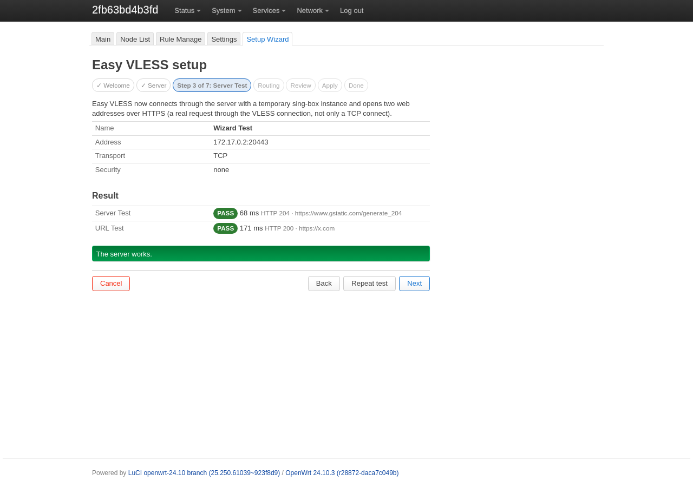

# Easy VLESS

Лёгкий VLESS-клиент для OpenWrt с веб-интерфейсом LuCI на русском и английском.

*A lightweight VLESS client for OpenWrt 24.10 with a LuCI web interface in Russian and English.*

**Текущая версия: 0.7.0-r1** · OpenWrt **24.10.x** (opkg) · Лицензия **GPL-3.0-only** · [Релизы](https://github.com/quargelk/easy-vless/releases)


## Содержание

- [Что такое Easy VLESS](#что-такое-easy-vless)
- [Возможности](#возможности)
- [Требования](#требования)
- [Установка](#установка)
  - [HTTPS на новом роутере](#https-на-новом-роутере)
- [Язык интерфейса](#язык-интерфейса)
- [Быстрый старт](#быстрый-старт)
- [First Run Wizard](#first-run-wizard)
- [Главная (Main)](#главная-main)
- [Список узлов (Node List)](#список-узлов-node-list)
- [Подписки](#подписки)
- [Server Test и URL Test](#server-test-и-url-test)
- [Правила (Rule Manage)](#правила-rule-manage)
- [Настройки (Settings)](#настройки-settings)
- [Обновление и удаление](#обновление-и-удаление)
- [FAQ](#faq)
- [Известные ограничения](#известные-ограничения)
- [Техническая документация](#техническая-документация)
- [Upstream и лицензия](#upstream-и-лицензия)

## Что такое Easy VLESS

Easy VLESS пропускает трафик роутера и устройств вашей сети через VLESS-сервер. Настраивать что-то на телефонах и компьютерах не нужно: трафик перехватывается на роутере прозрачно (nftables TPROXY), а соединение с сервером устанавливает sing-box.

Можно отправить через сервер весь трафик или только часть: например, российские сайты открывать напрямую, а остальные — через VLESS. Готовые правила для этого уже входят в пакет.

Проект основан на PassWall2 и оставляет из него только то, что нужно VLESS-клиенту.

## Возможности

- VLESS: TCP, WebSocket, gRPC, HTTPUpgrade; TLS, Reality, uTLS, flow `xtls-rprx-vision`
- импорт ссылок `vless://`, копирование ссылки сервера и QR-код
- подписки: списки `vless://` (в том числе в base64), sing-box JSON, Clash YAML; импортируются только VLESS-узлы
- подписки с User-Agent HAPP и HWID
- раздельное туннелирование: правила по доменам, IP и портам, готовые списки RUSSIA и PROXY, готовые правила QUIC и UDP
- Server Test — настоящий HTTPS-запрос через сервер — и группы URL Test с автоматическим выбором самого быстрого сервера
- DNS: прямой и удалённый DNS, FakeDNS, перенаправление DNS устройств сети
- мастер первой настройки (First Run Wizard)
- интерфейс LuCI на русском и английском

## Требования

| | |
|---|---|
| OpenWrt | **24.10.x** с менеджером пакетов `opkg` (OpenWrt 25.x с `apk` не поддерживается) |
| Память | **256 MB** RAM, **128 MB** flash (общий объём) |
| Свободное место | installer считает его сам; для новой установки на Cudy TR3000 v1 нужно около 32 MB |
| Архитектура | любая, для которой в официальном репозитории OpenWrt 24.10 есть `sing-box-tiny` >= 1.12 (пакеты Easy VLESS — `Architecture: all`) |
| Сеть | интернет, правильное системное время, HTTPS на роутере (см. [HTTPS на новом роутере](#https-на-новом-роутере)) |
| Конфликты | PassWall2 должен быть остановлен |

`sing-box-tiny` и `dnsmasq-full` installer ставит из официального репозитория OpenWrt. Системный `dnsmasq` заменяется на `dnsmasq-full` (нужна поддержка nftset) только после вашего подтверждения.

Проверено на реальном **Cudy TR3000 v1** (OpenWrt 24.10.3, `aarch64_cortex-a53`, sing-box-tiny 1.12.22). Другие архитектуры проверяются автоматическими тестами на настоящих образах OpenWrt.

## Установка

На роутере по SSH:

```sh
wget -O /tmp/install.sh https://github.com/quargelk/easy-vless/releases/download/v0.7.0/install.sh
sh /tmp/install.sh --check
sh /tmp/install.sh
```

- `--check` только проверяет роутер (версию OpenWrt, память, flash, свободное место, время, HTTPS, репозитории) и ничего не меняет.
- Без `--check` installer ставит `sing-box-tiny`, при необходимости заменяет `dnsmasq` на `dnsmasq-full` (спросит), затем пакеты Easy VLESS. Каждый файл релиза проверяется по `SHA256SUMS`.
- При любой ошибке installer останавливается и объясняет причину. `sh /tmp/install.sh --help` показывает все параметры.

После установки откройте **LuCI → Службы → Easy VLESS** (Services → Easy VLESS). На новом роутере сразу откроется [мастер настройки](#first-run-wizard).

Релиз `v0.7.0` на странице [Releases](https://github.com/quargelk/easy-vless/releases) содержит `easy-vless_0.7.0-r1_all.ipk`, `easy-vless-sing-box_0.7.0-r1_all.ipk`, `luci-app-easy-vless_0.7.0-r1_all.ipk`, `install.sh` и `SHA256SUMS`. Установка без installer'а, установка без интернета на роутере и подробности о проверках installer'а описаны в [технической документации](docs/technical.md).

### HTTPS на новом роутере

Все загрузки идут только по HTTPS с проверкой сертификата. Отключать проверку (`--no-check-certificate`) не нужно. Если `wget` на свежепрошитом роутере не может скачать installer, причина обычно одна из этих:

| Сообщение `wget` | Причина | Что сделать |
|---|---|---|
| `SSL verify error: unknown error` / `Invalid SSL certificate` | **неверное системное время**: у роутеров без батарейки часов (например, Cudy TR3000) после загрузки стоит дата сборки прошивки, пока время не синхронизировано | `ntpd -n -q -p 0.openwrt.pool.ntp.org`, затем проверить `date` |
| `certificate is self-signed or not signed by a trusted CA` | нет CA-сертификатов (пакет `ca-bundle`) | установить `ca-bundle` |
| `SSL support not available` | нет TLS-библиотеки для `wget` | установить `libustream-mbedtls` и `ca-bundle` |
| `Failed to send request: Operation not permitted` | не работает DNS или исходящий трафик блокирует правило nftables (например, от оставшегося PassWall) | проверить `nslookup github.com` и подключение к интернету |

Если на роутере нет TLS-библиотеки или `ca-bundle`, а скачать их нельзя, пакеты можно перенести с компьютера: installer проверит их подписью OpenWrt. Порядок действий — в разделе [HTTPS без TLS-библиотеки](docs/technical.md#https-без-tls-библиотеки) технической документации.

## Язык интерфейса

Интерфейс Easy VLESS переведён на русский и английский. Язык выбирается штатно в LuCI:

1. Установите русский перевод самой LuCI (если его ещё нет):

   ```sh
   opkg update
   opkg install luci-i18n-base-ru
   ```

2. В **Система → Система → Язык и тема** (System → System → Language and Style) выберите русский язык или **авто** (язык браузера).

Без `luci-i18n-base-ru` LuCI работает на английском, и Easy VLESS тоже. Сообщения sing-box и системные журналы показываются как есть, на английском.

Названия разделов:

| Русский | English |
|---|---|
| Главная | Main |
| Список узлов | Node List |
| Правила | Rule Manage |
| Настройки | Settings |
| Мастер настройки | Setup Wizard |

## Быстрый старт

1. Установите Easy VLESS (см. [Установка](#установка)).
2. Откройте **Службы → Easy VLESS**. Откроется мастер настройки.
3. Вставьте ссылку `vless://` вашего сервера, дождитесь проверки, выберите маршрутизацию и нажмите **Применить** (Apply).
4. Готово: на **Главной** видно, что Easy VLESS работает.

Без мастера: добавьте сервер в **Списке узлов**, на **Главной** выберите его в поле **Узел**, включите **Главный переключатель** и нажмите **Сохранить и запустить** (Save & Start).

## First Run Wizard

Мастер настройки открывается сам, пока Easy VLESS ещё не настроен: сервер не выбран, главный переключатель выключен и мастер ни разу не завершался. Если вы настроили Easy VLESS вручную, мастер сам не появляется. Открыть его можно всегда: вкладка **Мастер настройки** (Setup Wizard).



Шаги:

1. **Начало** — что понадобится: ссылка `vless://` от провайдера.
2. **Сервер** — вставьте одну ссылку `vless://` или выберите сервер, который уже есть в «Списке узлов». Мастер показывает параметры сервера и понятно объясняет ошибки: ссылка не VLESS, адрес подписки вместо ссылки, неверный UUID или порт, несколько ссылок сразу.
3. **Проверка сервера** — Server Test и URL Test через этот сервер. Если сервер не работает, видна причина; можно повторить проверку, вернуться или всё равно продолжить.
4. **Маршрутизация**:
   - **Рекомендуется** — российские сайты напрямую, остальное через VLESS (готовые правила RUSSIA, PROXY, QUIC, UDP);
   - **Всё через VLESS**;
   - **Оставить текущую маршрутизацию** — на уже настроенном роутере.
5. **Обзор** — всё, что будет изменено: сервер, правила, DNS, перенаправление трафика.
6. **Применить** — сохранение, проверка конфигурации в sing-box, запуск и проверка состояния службы.
7. **Готово** — итог и проверка соединения через Easy VLESS.

До шага «Применить» на роутере меняется только одно: добавляется сервер. **Отмена** удаляет сервер, добавленный в этом запуске мастера, и больше ничего не трогает. Если применить не удалось (конфигурация неверна или служба не запустилась), мастер возвращает прежнюю конфигурацию и показывает причину. Даже если страницу закрыли или роутер перезагрузился посреди применения, при следующем открытии мастер предложит восстановить прежнюю конфигурацию.

## Главная (Main)

Состояние службы (работает ли sing-box, главный переключатель, память, межсетевой экран, последние записи журнала), кнопки **Сохранить и запустить**, **Остановить**, **Проверить конфигурацию** и главный выбор — куда идёт трафик.

- **Главный переключатель** — включён: Easy VLESS запускается кнопкой «Сохранить и применить» и после каждой перезагрузки; выключен: служба останавливается.
- **Узел** — куда идёт трафик:
  - VLESS-сервер или группа URL Test — весь трафик через них;
  - **По правилам (Main Router)** — по правилам из раздела «Правила»: у каждого правила своя цель (напрямую, сервер, группа, блокировка), а трафик, не подошедший ни под одно правило, идёт в **По умолчанию**.
- **Проксировать сам роутер** / **Проксировать устройства LAN** — чей трафик проходит через Easy VLESS.

Внизу страницы — **Проверка соединения**: Server Test для каждой цели, которая сейчас используется.


Изменения применяются кнопкой **Сохранить и применить**. Если запуск не удался, окно запуска показывает причину; подробности — в **Последних записях журнала** и в **Проверить конфигурацию**.

## Список узлов (Node List)

Здесь три раздела: **Серверы**, **Подписки по URL** и **Группы URL-теста**.


**Серверы.** **Импорт VLESS-ссылки** принимает одну или несколько ссылок `vless://`, **Добавить VLESS** — ввод параметров вручную. Для каждого сервера:

- **Выбрать** — сделать его основным узлом (или целью по умолчанию, если узел — «По правилам»);
- **Проверить** — Server Test;
- **URL-тест**;
- **Копировать** — ссылка `vless://` и QR-код;
- **↑ / ↓** — порядок в списке;
- **Изменить** и **Удалить**.

Столбец **Статус** показывает, используется ли сервер сейчас, и результаты последних проверок. Сервер, который где-то используется, удалить нельзя: сначала выберите другую цель.

**Группы URL-теста.** Группа объединяет несколько серверов: sing-box периодически проверяет их и использует самый быстрый. Группу можно выбрать узлом на Главной, целью по умолчанию или целью правила. Пока группа используется работающей службой, под разделом видны текущие задержки серверов.

## Подписки

**Список узлов → Подписки по URL → Добавить подписку**: укажите имя и ссылку на подписку от вашего провайдера, сохраните и нажмите **Обновить** у подписки.


Формат подписки определяется автоматически:

| Формат | Поддержка |
|---|---|
| список ссылок `vless://` (обычный текст или base64) | да |
| sing-box JSON (`outbounds`), в том числе в base64 | да, экспериментально |
| Clash YAML (`proxies`) | только VLESS-узлы |

Импортируются только VLESS-узлы; узлы других типов пропускаются, их число видно в журнале. При обновлении добавленные вручную серверы не меняются, дубликаты не появляются. **Удалить узлы** удаляет узлы только этой подписки.

Параметры подписки:

| Параметр | Назначение |
|---|---|
| **Обновлять только при подключении** | автоматическое обновление только пока Easy VLESS работает (кнопка «Обновить» работает всегда) |
| **Поддержка HWID** | отправлять идентификатор роутера (для провайдеров, которые ограничивают число устройств) |
| **User-Agent** | По умолчанию (curl), HAPP или свой |
| **Автоматическое обновление** / **Интервал обновления** | обновлять подписку каждые 1–24 ч, пока Easy VLESS запущен |
| **Способ загрузки** | напрямую, через прокси или автоматически |
| **Разрешить небезопасные узлы** | сохранять флаг allowInsecure у импортированных узлов (по умолчанию выключено) |

**HAPP / HWID.** Если провайдер отдаёт подписку только приложению HAPP, выберите **User-Agent: HAPP** и, если провайдер этого требует, включите **Поддержку HWID**. Тогда запрос отправляется с `User-Agent: HAPP` и заголовками `X-HWID`, `X-Device-OS`, `X-Ver-OS`, `X-Device-Model`. HWID создаётся один раз и не меняется при обновлении пакета и перезагрузке.

Подписка всегда скачивается по HTTPS с проверкой сертификата. Если сертификат проверить нельзя (обычно из-за неверного времени на роутере), обновление не выполняется, причина видна в журнале.

> Не публикуйте ссылку на подписку, HWID и другие личные данные на скриншотах.

## Server Test и URL Test

**Server Test** (**Проверить** в «Списке узлов», **Проверка соединения** на Главной) запускает временный экземпляр sing-box с этим сервером и открывает через него `https://www.gstatic.com/generate_204`. Это настоящий запрос через VLESS, а не проверка открытого порта. Работает и при остановленном Easy VLESS. При ошибке показывается причина: таймаут, ошибка TLS, нет ответа сервера.

**URL Test** делает то же с адресом `https://x.com`, а в группах URL-теста sing-box сам регулярно проверяет серверы и выбирает самый быстрый. **Проверить все серверы сейчас** запускает проверку группы вручную.

После запуска Easy VLESS работу можно проверить и обычными сайтами, например `2ip.io` или `speedtest.net`.

## Правила (Rule Manage)

Правило описывает, какой трафик ему подходит (домены, IP, порты, протокол), а его **цель** — куда этот трафик идёт: напрямую, через сервер или группу, или блокировка. Цель задаётся в правиле или на Главной. Правила работают, пока на Главной в поле **Узел** выбрано **По правилам (Main Router)**.


Готовые правила добавляются одной кнопкой: выберите правило рядом с **Добавить правило** и нажмите **Добавить готовое правило**.

- **RUSSIA** — российские домены, по умолчанию напрямую;
- **PROXY** — домены, которые нужно открывать через сервер;
- **QUIC** — UDP 443;
- **UDP** — весь UDP.

Правила проверяются сверху вниз, срабатывает первое подходящее; порядок меняется кнопками ↑ / ↓. В **Изменить** через **+ Добавить условие** можно добавить свои условия: домены, IP, порты, источник, протокол. Готовые списки доменов перечислены в разделе **Ресурсы** внизу страницы.

## Настройки (Settings)

Значения по умолчанию подходят для большинства случаев. Изменения применяются кнопкой **Сохранить и применить**.

**DNS**: прямой DNS (для доменов, которые идут напрямую; по умолчанию DNS провайдера), удалённый DNS (для проксируемых доменов, запросы идут через сервер; TCP, UDP, DoT или DoH), FakeDNS, статические DNS-записи и перенаправление DNS устройств сети на роутер.


**Перенаправление** (Forwarding): какие порты TCP и UDP направляются в Easy VLESS, а какие никогда не проксируются, способ перенаправления TCP (TPROXY или REDIRECT), IPv6 TProxy (экспериментально) и локальный ответ на ping.


**Дополнительно**: уровень и запись журнала sing-box, порт Clash API, SOCKS-порт, задержка запуска после загрузки.

## Обновление и удаление

**Обновление** — тем же installer'ом новой версии (команды из раздела [Установка](#установка)). Настройки (`/etc/config/easy_vless`) и HWID сохраняются.

**Удаление**:

```sh
opkg remove luci-app-easy-vless easy-vless-sing-box easy-vless
```

Перед удалением служба останавливается, её правила nftables и изменения DNS убираются. `sing-box-tiny` и `dnsmasq-full` остаются.

## FAQ

**Мастер не открывается сам.** Он открывается только на ненастроенном роутере. Откройте вкладку **Мастер настройки** вручную.

**Server Test не проходит.** Проверьте ссылку (адрес, порт, UUID, ключ Reality), что сервер работает и что у роутера есть интернет. «Таймаут» обычно значит, что сервер недоступен; «ошибка TLS» — что сервер отклонил соединение или неверны параметры TLS/Reality.

**Easy VLESS не запускается.** Нажмите **Проверить конфигурацию** на Главной: sing-box покажет, что не так. Проверьте, что в поле **Узел** что-то выбрано. Если в журнале запуска есть сообщение про `dnsmasq`, нужен `dnsmasq-full` (installer предлагает замену).

**Подписка не обновляется.** Проверьте время на роутере (`date`) и ссылку. Если провайдер требует HAPP или HWID, включите их в параметрах подписки. Причина видна в окне обновления.

**Интерфейс на английском.** Установите `luci-i18n-base-ru` и выберите русский язык в LuCI (см. [Язык интерфейса](#язык-интерфейса)).

**Ping не проходит через VLESS.** VLESS не передаёт ICMP. Параметр **Отвечать на ping локально** в «Настройках» заставляет роутер сам отвечать на ping к проксируемым адресам.

## Известные ограничения

- Только протокол VLESS; узлы других типов в подписках пропускаются.
- Только OpenWrt 24.10.x с `opkg`.
- Нужен `dnsmasq-full` (с поддержкой nftset); без него служба не запускается.
- На реальном устройстве проверен только Cudy TR3000 v1; другие архитектуры проверены автоматическими тестами.
- Подписки в формате sing-box JSON — экспериментальные; Clash YAML не покрыт автоматическими тестами.
- Режим маршрутизации — только через sing-box.
- Отдельного интерфейса для Xray нет; группы URL-теста работают только с sing-box.
- Условия правил `geoip:` / `geosite:` (кроме встроенного `geoip:private`) требуют дополнительного пакета `easy-vless-geodata`, который зависит от стороннего репозитория.
- IPv6 TProxy — экспериментально.
- Экспорта и импорта всей конфигурации нет (ссылку отдельного сервера можно скопировать).

## Техническая документация

Установка без installer'а, офлайн-установка, проверки installer'а, архитектуры, пакеты и зависимости, тесты и сборка: [docs/technical.md](docs/technical.md).

## Upstream и лицензия

Easy VLESS основан на [PassWall2](https://github.com/Openwrt-Passwall/openwrt-passwall2) 25.5.15-1 (commit `394f3842969161ddd888187e72db4b493b3310b4`). Оригинальные уведомления об авторских правах и лицензии сохранены в исходных файлах.

Лицензия: GPL-3.0-only, полный текст — [LICENSE](LICENSE).
