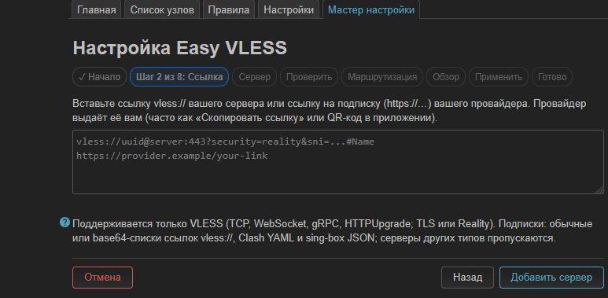
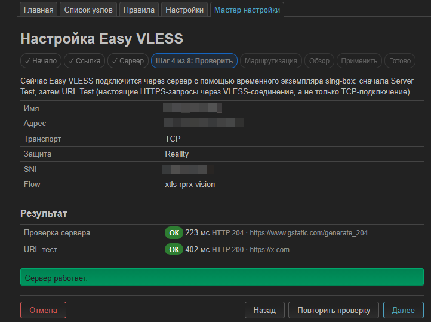
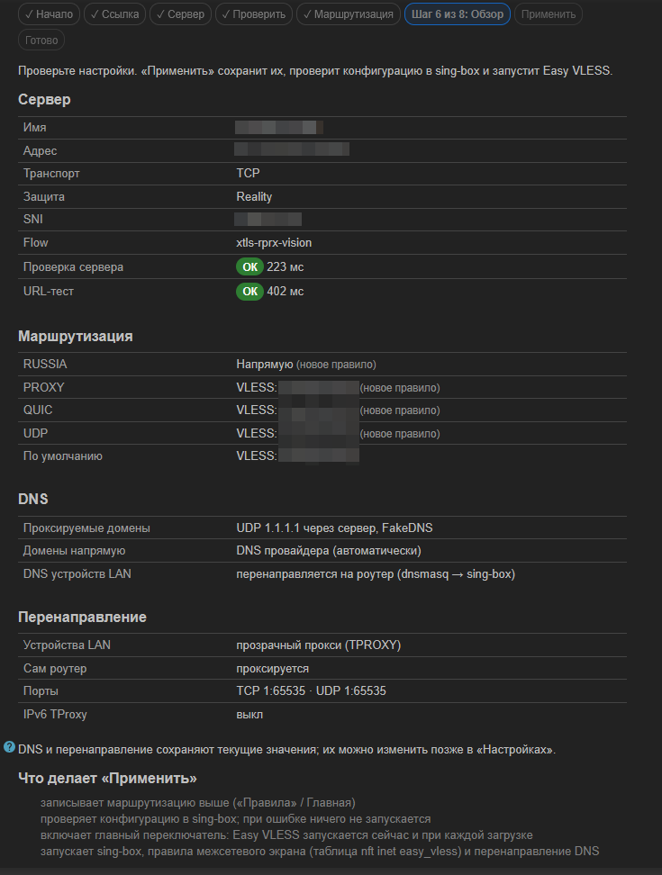
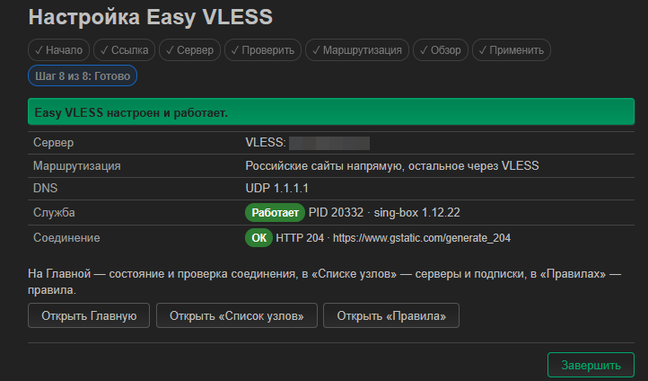
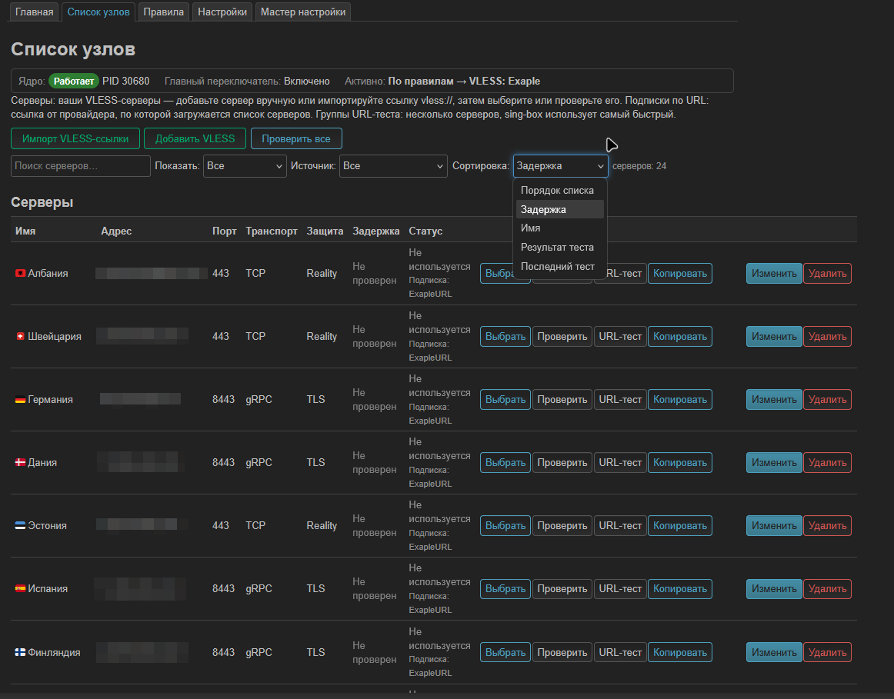

# Easy VLESS

Лёгкий VLESS-клиент для OpenWrt 24.10 с веб-интерфейсом LuCI на русском и английском.

*A lightweight VLESS client for OpenWrt 24.10 with a LuCI web interface in Russian and English.*

**Текущая версия: 0.9.0-r1** · OpenWrt **24.10.x** (`opkg`) · Лицензия **GPL-3.0-only** · [Релизы](https://github.com/quargelk/easy-vless/releases)

Easy VLESS направляет трафик роутера и всех устройств домашней сети через ваш VLESS-сервер. На телефонах, компьютерах и телевизорах ничего настраивать не нужно: роутер сам перехватывает соединения через nftables (прозрачный прокси TPROXY) и передаёт их в [sing-box](https://sing-box.sagernet.org/), который устанавливает VLESS-соединение с сервером. Правила решают, какой трафик идёт напрямую, а какой — через VLESS: например, российские сайты — напрямую, остальное — через сервер.

Easy VLESS — самостоятельный проект для OpenWrt: собственный интерфейс LuCI, мастер первой настройки, «Список узлов», подписки и проверки серверов. Часть runtime (перехват трафика, генерация конфигурации sing-box, разбор подписок) основана на коде PassWall2 — см. [Дополнительно](#дополнительно).


## Содержание

- [Возможности](#возможности)
- [Что нового в 0.8](#что-нового-в-08)
- [Как это работает](#как-это-работает)
- [Требования](#требования)
- [Установка](#установка)
- [Первый запуск](#первый-запуск)
- [Мастер настройки](#мастер-настройки)
- [Главная](#главная)
- [Список узлов](#список-узлов)
- [Подписки](#подписки)
- [Проверка соединения](#проверка-соединения)
- [Правила](#правила)
- [DNS](#dns)
- [Перенаправление](#перенаправление)
- [Настройки](#настройки)
- [Обновление](#обновление)
- [Удаление](#удаление)
- [FAQ](#faq)
- [Ограничения](#ограничения)
- [Структура проекта](#структура-проекта)
- [Дополнительно](#дополнительно)

## Возможности

- **VLESS** — транспорт TCP, WebSocket, gRPC, HTTPUpgrade; защита TLS, Reality, uTLS; flow `xtls-rprx-vision`.
- **Серверы** — импорт ссылок `vless://` (одной или списком), ручной ввод, копирование ссылки и QR-код.
- **Список узлов** — задержка и состояние проверки каждого сервера, источник сервера, сортировка, поиск, фильтры, **Проверить все**.
- **Подписки** — списки `vless://` (в том числе в base64), Clash YAML, sing-box JSON; импортируются VLESS-узлы. Состояние обновления в таблице, User-Agent «Авто» / HAPP / свой, HWID, автоматическое обновление.
- **Раздельная маршрутизация** — правила по доменам, IP, портам, протоколу; готовые правила RUSSIA, PROXY, QUIC, UDP; у каждого правила своя цель. Условия `geoip:` / `geosite:` — с необязательным пакетом `easy-vless-geodata`.
- **Проверки** — Server Test (настоящий HTTPS-запрос через VLESS-соединение), URL Test, группы URL-теста с автоматическим выбором самого быстрого сервера.
- **DNS** — прямой DNS для прямых доменов, удалённый DNS через сервер для проксируемых (UDP, TCP, DoT, DoH), FakeDNS, перенаправление DNS устройств сети.
- **Перенаправление** — прозрачный прокси TPROXY (или REDIRECT) для устройств LAN и самого роутера, выбор портов, исключения, IPv6 TProxy.
- **Мастер первой настройки** — от ссылки `vless://` или ссылки на подписку до работающей службы, с откатом при ошибке.
- **Интерфейс LuCI** на русском и английском.

## Что нового в 0.8

0.8 — крупное обновление интерфейса:

- **Список узлов**: задержка каждого сервера, состояния проверки («Работает», «Ошибка», «Проверка…», «В очереди», «Не проверен»), источник сервера, поиск, фильтры и сортировка — в том числе по задержке.
- **Проверить все** — проверка всех серверов одной кнопкой, с прогрессом и отменой.
- **Server Test и URL Test** выполняются роутером по очереди: вместо сообщения «ещё выполняется, подождите» кнопка показывает «Проверка…», затем результат. Результат сохраняется и после перехода на другую страницу.
- **Подписки**: состояние и результат обновления прямо в таблице, защита от повторного обновления, сохранение узлов при ошибочном ответе.
- **User-Agent «Авто»**: обычный запрос, а при необходимости — один запрос как HAPP; вместе с HWID.
- **Мастер настройки 2.0** принимает и ссылку `vless://`, и ссылку на подписку, сам определяет тип, показывает серверы подписки и позволяет выбрать один.

## Как это работает

```text
Устройства LAN и сам роутер
            │
            ▼
       Easy VLESS          настройки LuCI → конфигурация sing-box
            │
            ▼
   nftables / TPROXY       перехват TCP/UDP-соединений
            │
            ▼
        sing-box
            │
            ▼
  правила маршрутизации    условия → цель; иначе «По умолчанию»
            │
      ┌─────┴─────┐
  напрямую      VLESS      (или группа URL-теста, или блокировка)

DNS: dnsmasq роутера → sing-box → прямой DNS или удалённый DNS через сервер
```

- **Easy VLESS** — служба и интерфейс LuCI вокруг sing-box. Он хранит настройки, создаёт из них конфигурацию sing-box, проверяет её перед каждым запуском (`sing-box check`), включает перехват трафика и DNS и запускает всё это одной кнопкой.
- **TPROXY** (nftables) передаёт соединения в sing-box с исходным адресом назначения, поэтому правила по IP и портам работают без настройки клиентов.
- **sing-box** — ядро, которое делает сетевую работу: применяет правила и устанавливает VLESS-соединения с сервером.
- **Правила** проверяются сверху вниз; всё, что не подошло ни под одно правило, идёт в цель **По умолчанию**.
- **DNS**: пока Easy VLESS работает, dnsmasq передаёт запросы в sing-box. Домены, которые идут напрямую, разрешает прямой DNS, а проксируемые — удалённый DNS, по умолчанию через сервер.
- При остановке Easy VLESS убирает свои правила nftables, маршруты и изменения DNS: роутер работает как без него.

## Требования

| | |
|---|---|
| OpenWrt | **24.10.x** с менеджером пакетов `opkg` (OpenWrt 25.x с `apk` не поддерживается) |
| Память | **256 MB** RAM, **128 MB** flash (общий объём накопителя) |
| Свободное место | installer считает его сам; для новой установки на Cudy TR3000 v1 нужно около 32 MB |
| Архитектура | любая, для которой в официальном репозитории OpenWrt 24.10 есть `sing-box-tiny` >= 1.12; пакеты Easy VLESS — `Architecture: all` |
| Зависимости | `sing-box-tiny` и `dnsmasq-full` (dnsmasq с поддержкой nftset) из официального репозитория OpenWrt — их ставит installer |
| Сеть | интернет, правильное системное время, работающий HTTPS на роутере (см. [HTTPS на новом роутере](#https-на-новом-роутере)) |
| Конфликты | PassWall / PassWall2 должны быть остановлены |

Проверено на реальном **Cudy TR3000 v1** (OpenWrt 24.10.3, `aarch64_cortex-a53`, sing-box-tiny 1.12.22). Другие архитектуры (x86-64, ARM, MIPS) проверяются автоматическими тестами на образах OpenWrt.

## Установка

На роутере по SSH:

```sh
wget -O /tmp/install.sh https://github.com/quargelk/easy-vless/releases/download/v0.9.0/install.sh
sh /tmp/install.sh --check
sh /tmp/install.sh
```

- `--check` — безопасная предварительная проверка: версия OpenWrt, память, flash, свободное место, время, HTTPS, репозитории. Ничего не устанавливает и не меняет.
- Без `--check` installer ставит `sing-box-tiny`, при необходимости заменяет `dnsmasq` на `dnsmasq-full` (сначала спросит), затем пакеты Easy VLESS. Каждый файл релиза проверяется по `SHA256SUMS`.
- При ошибке installer останавливается и объясняет причину. Все параметры: `sh /tmp/install.sh --help`.

Релиз `v0.9.0` содержит `easy-vless_0.9.0-r1_all.ipk`, `easy-vless-sing-box_0.9.0-r1_all.ipk`, `luci-app-easy-vless_0.9.0-r1_all.ipk`, `install.sh` и `SHA256SUMS`. Ручная установка и установка без интернета на роутере описаны в [технической документации](docs/technical.md).

### HTTPS на новом роутере

Все загрузки идут только по HTTPS с проверкой сертификата; отключать проверку (`--no-check-certificate`) не нужно. Если `wget` на свежепрошитом роутере не может скачать installer, причина обычно одна из этих:

| Сообщение `wget` | Причина | Что сделать |
|---|---|---|
| `SSL verify error: unknown error` / `Invalid SSL certificate` | **неверное системное время**: у роутеров без батарейки часов (например, Cudy TR3000) после загрузки стоит дата сборки прошивки, пока время не синхронизировано | `ntpd -n -q -p 0.openwrt.pool.ntp.org`, затем проверить `date` |
| `certificate is self-signed or not signed by a trusted CA` | нет CA-сертификатов | установить `ca-bundle` |
| `SSL support not available` | нет TLS-библиотеки для `wget` | установить `libustream-mbedtls` и `ca-bundle` |
| `Failed to send request: Operation not permitted` | не работает DNS или исходящий трафик блокирует правило nftables (например, от оставшегося PassWall) | проверить `nslookup github.com` и подключение к интернету |

Если TLS-библиотеку и `ca-bundle` скачать нельзя, их можно перенести с компьютера — см. [HTTPS без TLS-библиотеки](docs/technical.md#https-без-tls-библиотеки).

## Первый запуск

1. Установите Easy VLESS (см. [Установка](#установка)).
2. Откройте **LuCI → Службы → Easy VLESS** (Services → Easy VLESS). На ненастроенном роутере сразу откроется [мастер настройки](#мастер-настройки).
3. Вставьте ссылку `vless://` вашего сервера или ссылку на подписку провайдера — мастер сам определит, что это.
4. Выберите сервер и дождитесь проверки: «Проверка сервера» и «URL-тест» должны показать «ОК».
5. Выберите маршрутизацию (рекомендуемая: российские сайты напрямую, остальное через VLESS).
6. На шаге «Обзор» проверьте изменения и нажмите **Применить**.

Готово: на **Главной** видно, что Easy VLESS работает. Без мастера: добавьте сервер в «Списке узлов», на Главной выберите его в поле **Узел**, включите **Главный переключатель** и нажмите **Сохранить и запустить**.

**Язык интерфейса.** Easy VLESS использует язык LuCI. Для русского установите перевод LuCI и выберите язык в **Система → Система → Язык и тема** (русский или «авто» — язык браузера):

```sh
opkg update
opkg install luci-i18n-base-ru
```

| Русский | English |
|---|---|
| Главная | Main |
| Список узлов | Node List |
| Правила | Rule Manage |
| Настройки | Settings |
| Мастер настройки | Setup Wizard |

## Мастер настройки

Мастер первой настройки (First Run Wizard) проводит от ссылки провайдера до работающего Easy VLESS: добавляет сервер или подписку, проверяет выбранный сервер, настраивает маршрутизацию, показывает все изменения и запускает службу.

Он открывается сам, пока Easy VLESS не настроен (не выбран сервер, выключен главный переключатель и мастер ещё не завершался). На уже настроенном роутере его можно открыть вкладкой **Мастер настройки**. До последнего шага на роутере меняется только одно — в «Список узлов» добавляется сервер или подписка.

```text
Начало → Ссылка → Сервер → Проверить → Маршрутизация → Обзор → Применить → Готово
```

### Шаг 1 — Начало

Мастер кратко объясняет, что он сделает и что понадобится: ссылка `vless://` вашего сервера или ссылка на подписку провайдера.


### Шаг 2 — Ссылка

Вставьте ссылку — мастер сам определяет её тип:

- `vless://…` — один сервер; кнопка **Добавить сервер** добавляет его в «Список узлов»;
- `https://…` (или `http://…`) — ссылка на подписку; кнопка **Загрузить подписку**. Роутер загружает подписку и ищет в ней VLESS-серверы. Ссылка считается подпиской, только если найден хотя бы один VLESS-сервер; иначе подписка не создаётся, а мастер объясняет причину.

В **Параметрах подписки** можно включить отправку ID устройства (HWID) и выбрать User-Agent (по умолчанию «Авто», см. [Подписки](#подписки)). Ошибки объясняются понятно: ссылка не VLESS, неверный UUID или порт, неподдерживаемый транспорт, в подписке нет VLESS-серверов. Если в «Списке узлов» уже есть серверы, вместо ссылки можно выбрать один из них.



*Поле ввода ссылки на сервер или на подписку — тип ссылки мастер определяет сам.*

### Шаг 3 — Сервер

Для ссылки `vless://` показываются параметры добавленного сервера. Для подписки — список её VLESS-серверов с именем, адресом, портом, транспортом и задержкой (если сервер уже проверялся); выберите один. **Проверить все** проверяет все серверы подписки по очереди; самый быстрый при этом автоматически не выбирается.


### Шаг 4 — Проверка

Сначала Server Test («Проверка сервера»), после него URL Test («URL-тест») — настоящие HTTPS-запросы через VLESS-соединение с выбранным сервером. Пока проверка идёт, видно «Проверка…».

Если сервер не отвечает, показывается причина; можно **Повторить проверку**, вернуться и выбрать другой сервер или **Всё равно продолжить**. Если не прошёл только URL Test, его можно повторить отдельно — успешный Server Test при этом сохраняется.



### Шаг 5 — Маршрутизация

Доступные схемы:

- **Рекомендуется: российские сайты напрямую, остальное через VLESS** — готовые правила: RUSSIA — напрямую; PROXY, QUIC, UDP и «По умолчанию» — через выбранный сервер;
- **Всё через VLESS**;
- **Оставить текущую маршрутизацию** — на уже настроенном роутере.


### Шаг 6 — Обзор

Всё, что будет применено: сервер и результаты его проверок, правила и их цели, DNS, перенаправление и предупреждения (например, если сервер не прошёл проверку).



Кнопка **Применить** сохраняет копию текущей конфигурации, записывает новую, проверяет её в sing-box, запускает Easy VLESS и проверяет состояние службы; каждый этап отмечается по мере выполнения.

### Шаг 8 — Готово

Итог: сервер, маршрутизация, DNS, состояние службы и проверка соединения через Easy VLESS.



**Ошибки и отмена.** Если применить не удалось (конфигурация неверна или служба не запустилась), мастер возвращает прежнюю конфигурацию и показывает причину. Если страницу закрыли или роутер перезагрузился посреди применения, при следующем открытии мастер предложит **Восстановить прежнюю конфигурацию**. **Отмена** удаляет сервер или подписку (с её серверами), добавленные в этом запуске мастера, и больше ничего не трогает. Серверы и подписки, добавленные мастером, — обычные записи «Списка узлов»: их можно изменять, проверять и использовать в правилах.

## Главная

Состояние службы и главный выбор — куда идёт трафик (скриншот — в начале страницы).

- **Карточки состояния** — работает ли ядро sing-box, главный переключатель, активная цель, версия sing-box, память, таблица межсетевого экрана, режим маршрутизации; под ними раскрываются **Последние записи журнала**.
- **Главный переключатель** — включён: Easy VLESS запускается кнопкой «Применить» внизу страницы и после каждой перезагрузки роутера; выключен: служба останавливается.
- **Узел**:
  - VLESS-сервер или группа URL-теста — весь трафик идёт через них;
  - **По правилам (Main Router)** — трафик распределяется правилами из раздела «Правила». Для каждого правила выбирается цель (напрямую, сервер, группа, блокировка или «Не используется»), а **По умолчанию** — цель для всего, что не подошло ни под одно правило.
- **Проксировать сам роутер** / **Проксировать устройства LAN** — чей трафик проходит через Easy VLESS.
- **Проверка соединения** — Server Test серверов, которые сейчас используются как цели правил и «По умолчанию» (кнопка **Проверить все цели**).

Кнопки:

- **Сохранить и запустить** — сохранить, проверить конфигурацию в sing-box и (пере)запустить службу;
- **Остановить** — остановить службу и выключить главный переключатель;
- **Проверить конфигурацию** — создать конфигурацию sing-box и проверить её, ничего не запуская.

Внизу страницы кнопка **Применить** (Save & Apply) применяет изменения к службе; **Сохранить** только записывает настройки.

## Список узлов

Страница состоит из трёх разделов:

- **Серверы** — ваши VLESS-серверы: добавленные вручную и из подписок;
- **Подписки по URL** — ссылки провайдеров, по которым загружаются списки серверов (см. [Подписки](#подписки));
- **Группы URL-теста** — несколько серверов, из которых sing-box сам выбирает самый быстрый.

**Импорт VLESS-ссылки** принимает одну или несколько ссылок `vless://`; **Добавить VLESS** — ввод параметров вручную (адрес, порт, UUID, транспорт, TLS/Reality).


### Поиск, фильтры и сортировка

- **Поиск серверов** — по имени, адресу или статусу.
- **Показать** — все, работающие, с ошибкой, не проверенные или проверяемые сейчас.
- **Источник** — все, добавленные вручную или конкретная подписка.
- **Сортировка**:
  - **Порядок списка** — сохранённый порядок (кнопки ↑ / ↓);
  - **Задержка** — сначала работающие серверы от самого быстрого, затем серверы с ошибкой, затем непроверенные;
  - **Имя**;
  - **Результат теста** — работающие, с ошибкой, непроверенные;
  - **Последний тест** — сначала недавно проверенные.

При одинаковых значениях порядок всегда один и тот же (по имени). Сортировка и фильтры меняют только отображение: сохранённый порядок серверов остаётся прежним, а выбор запоминается в браузере.



### Задержка, статус и проверки

Задержка и статус показываются в разных столбцах:

- **Задержка** — результат последнего Server Test: задержка в миллисекундах и «Работает»; «Ошибка» (причина — во всплывающей подсказке); «Проверка…» или «В очереди», пока проверка идёт; «Не проверен», если сервер ещё не проверялся. Под результатом — когда была проверка. Пока идёт новая проверка, прежний результат остаётся виден бледнее.
- **Статус** — используется ли сервер сейчас («Активно», «Выбран (остановлен)», «Используется: N», «Не используется»), результат URL Test и источник: название подписки или «Добавлен вручную».

«Не проверен» и «Ошибка» — это отсутствие задержки, а не «0 мс»: при сортировке по задержке такие серверы идут после работающих.

Действия у каждого сервера:

- **Выбрать** — сделать сервер основным узлом (или целью «По умолчанию», если узел — «По правилам»);
- **Проверить** — Server Test; **URL-тест** — проверка доступности `https://x.com` через сервер (см. [Проверка соединения](#проверка-соединения));
- **Копировать** — ссылка `vless://` и QR-код;
- **↑ / ↓**, **Изменить**, **Удалить**.

**Проверить все** запускает Server Test всех серверов по очереди. Вместо кнопки видны прогресс («Проверка… 3 из 24») и **Отмена** — она убирает ещё не начатые проверки, текущая завершается. Результаты появляются в таблице по мере готовности. Повторное нажатие «Проверить» у сервера, который уже проверяется или стоит в очереди, новой проверки не добавляет.

Сервер, который где-то используется, удалить нельзя — сначала выберите другую цель. После изменения сервера его прежние результаты проверки сбрасываются.

### Группы URL-теста

Группа объединяет несколько серверов: sing-box регулярно проверяет их (по умолчанию через `https://x.com`) и использует самый быстрый. Группу можно выбрать узлом на Главной, целью «По умолчанию» или целью правила. Пока группа используется работающей службой, под разделом видны текущие задержки серверов и кнопка **Проверить все серверы сейчас**.

## Подписки

Подписка — это ссылка от провайдера, по которой загружается список серверов. Подписку добавляет мастер настройки или **Список узлов → Подписки по URL → Добавить подписку**: укажите имя и ссылку, сохраните и нажмите **Обновить**.


### Форматы

Формат определяется автоматически:

- список ссылок `vless://` — обычным текстом или в base64;
- Clash YAML с узлами VLESS;
- sing-box JSON (outbounds VLESS).

Импортируются только VLESS-узлы, узлы других протоколов пропускаются.

### Обновление

- **Обновить** загружает подписку сейчас; **Обновить все подписки** — все сразу.
- Пока идёт обновление, в столбце **Статус** видно «Обновление…», а кнопки обновления недоступны — второе обновление не запустится.
- Затем там же показывается результат: сколько узлов получено, сколько было и стало, формат и время обновления — или понятная причина ошибки (ошибка загрузки с HTTP-кодом, пустой ответ, нет поддерживаемых узлов VLESS, сертификат не прошёл проверку).
- Если подписка не загрузилась, пришёл пустой ответ или в нём нет поддерживаемых узлов, **существующие узлы подписки сохраняются**.
- Добавленные вручную серверы при обновлении не меняются, дубликаты не появляются, результаты проверок серверов сохраняются.
- **Удалить узлы** удаляет узлы только этой подписки; удаление самой подписки её узлы оставляет.
- **Автоматическое обновление** — каждые 1–24 ч, пока Easy VLESS запущен; **Обновлять только при подключении** пропускает автоматическое обновление, пока Easy VLESS не работает.
- **Способ загрузки** — напрямую, через работающий прокси или автоматически.

### User-Agent, HAPP и HWID

Некоторые провайдеры отдают список серверов только приложению HAPP или ограничивают число устройств. Варианты User-Agent:

- **Авто (curl, при необходимости HAPP)** — по умолчанию для новых подписок, см. ниже;
- **По умолчанию (curl)** — всегда обычный запрос;
- **HAPP** — всегда `User-Agent: HAPP`;
- **Свой** — произвольный User-Agent.

Стратегия **«Авто»**:

1. Обычный запрос (User-Agent curl).
2. Если провайдер ответил ошибкой HTTP 4xx или в ответе нет поддерживаемых узлов —
3. один повторный запрос с `User-Agent: HAPP`.
4. Итого не больше двух запросов за обновление (не считая автоматических повторов curl при временной ошибке сети или сервера).

Ошибки сети, TLS и сервера (5xx) запроса как HAPP не вызывают. Режим «Авто» не гарантирует совместимость с любым провайдером: он лишь пробует оба распространённых варианта. Если провайдер ответил только на запрос HAPP, это видно в результате обновления.

**Поддержка HWID** добавляет к каждому запросу заголовки `X-HWID`, `X-Device-OS`, `X-Ver-OS`, `X-Device-Model`. HWID создаётся один раз, хранится в `/etc/easy_vless/hwid` и не меняется при обновлении и перезагрузке.

Подписка всегда загружается с проверкой сертификата HTTPS. **Разрешить небезопасные узлы** относится только к импортированным серверам (флаг allowInsecure), а не к загрузке подписки.

> Не публикуйте ссылку на подписку, UUID и HWID — ни в тексте, ни на скриншотах.

## Проверка соединения

| | Server Test («Проверить», «Проверка сервера») | URL Test («URL-тест») |
|---|---|---|
| Адрес | `https://www.gstatic.com/generate_204` | `https://x.com` |
| Что проверяет | работает ли VLESS-соединение с сервером | открывается ли через сервер реальный сайт |
| Успех | ответ 200 или 204 | любой HTTP-ответ |

- **Server Test** запускает временный экземпляр sing-box с этим сервером и выполняет через него настоящий HTTPS-запрос. Это проверка VLESS-соединения, а не проверка открытого порта или ping. Работает и при остановленном Easy VLESS. Задержка — время до первого ответа через сервер. При ошибке показывается причина: таймаут, ошибка TLS, нет ответа через VLESS-соединение.
- **URL Test** делает такой же запрос к `https://x.com`. Если Server Test прошёл, а URL Test нет, сервер работает, но этот сайт через него недоступен.
- В **группах URL-теста** sing-box проверяет серверы сам и выбирает самый быстрый.

Все проверки выполняет роутер по очереди, одну за другой, с учётом запуска, остановки и проверки конфигурации службы. После нажатия кнопка показывает «Проверка…» (или «В очереди»), затем результат. Результат последней проверки каждого сервера хранится в памяти роутера до перезагрузки, поэтому после перехода на другую страницу видно, что проверка ещё идёт, или её результат.

Проверки запускаются из «Списка узлов», из мастера настройки и из блока **Проверка соединения** на Главной.

## Правила

Правило = **условия** (какой трафик ему подходит) + **цель** (куда этот трафик идёт). Правила работают, пока на Главной в поле **Узел** выбрано **По правилам**.

```text
условия правила (домены, ресурс доменов, IP, порты, протокол, источник) → цель (напрямую / сервер / группа / блокировка)
```


- **Порядок** — правила проверяются сверху вниз, срабатывает первое подходящее. Порядок меняется кнопками ↑ / ↓.
- **По умолчанию** (на Главной) — цель для трафика, который не подошёл ни под одно правило.
- **Готовые правила** добавляются одной кнопкой: выберите правило рядом с **Добавить правило** и нажмите **Добавить готовое правило**.

| Готовое правило | Условия | Цель по умолчанию |
|---|---|---|
| **RUSSIA** | российские домены (`.ru`) | напрямую |
| **PROXY** | список доменов, которые нужно открывать через сервер | выбранный сервер |
| **QUIC** | UDP, порт 443 (HTTP/3) | выбранный сервер |
| **UDP** | весь остальной UDP | выбранный сервер |

- **Свои условия** — в **Изменить → + Добавить условие**: домены (`domain:`, `full:`, `regexp:`, ключевое слово), IP и подсети, порты, источник, протокол. Разные типы условий должны выполняться вместе; домены, ресурсы доменов и IP — альтернативы, достаточно любого из них.

Готовые списки доменов перечислены в разделе **Ресурсы** внизу страницы.

## DNS

**Настройки → DNS.** Значения по умолчанию подходят для большинства случаев.


| Поле | Что задаёт |
|---|---|
| **Прямой DNS** | DNS для доменов, которые идут напрямую: «Авто» (DNS вашего провайдера) или свой сервер по UDP или TCP |
| **Прямой DNS: версии IP** | `UseIP` (IPv4 и IPv6), `UseIPv4` или `UseIPv6` |
| **Протокол удалённого DNS** | UDP, TCP, DoT или DoH — для проксируемых доменов |
| **Удалённый DNS** | адрес сервера (например `1.1.1.1`) или, для DoH, ссылка |
| **EDNS Client Subnet для удалённого DNS** | необязательный публичный IP, который передаётся DNS-серверу как местоположение клиента; пусто — выключено |
| **Маршрут удалённого DNS** | «Удалённо (через прокси)» — через сервер, или напрямую |
| **FakeDNS** | проксируемые домены получают временные «поддельные» IP, а настоящее разрешение имени выполняется на сервере; соединения устанавливаются быстрее |
| **Удалённый DNS: версии IP** | `UseIP`, `UseIPv4` (по умолчанию) или `UseIPv6` |
| **Статические DNS-записи** | свои соответствия, по одной в строке: `домен IP` |
| **Перенаправление DNS** | DNS-запросы устройств LAN принудительно идут на роутер, даже если на устройстве указан другой DNS-сервер, — так DNS-правила Easy VLESS действуют на все устройства |

## Перенаправление

**Настройки → Перенаправление** — какие соединения попадают в Easy VLESS. Чей трафик перенаправляется — устройств LAN и/или самого роутера — выбирается на [Главной](#главная).


- **TCP-порты / UDP-порты для перенаправления** — по умолчанию все. Соединения на другие порты идут напрямую, минуя правила.
- **TCP-порты / UDP-порты, которые никогда не проксируются** — исключения с наивысшим приоритетом.
- **Способ перенаправления TCP** — **TPROXY** (по умолчанию, сохраняет исходный адрес назначения для sing-box) или **REDIRECT** как запасной вариант.
- **IPv6 TProxy** — перехват IPv6-соединений (экспериментально; сервер должен поддерживать IPv6).
- **Отвечать на ping локально** — ping (ICMP) через VLESS не проходит; если включено, на ping к проксируемому адресу отвечает сам роутер.

Порты задаются через запятую, диапазоны — `от:до`, например `21,80,443,1000:2000`.

## Настройки

Кроме [DNS](#dns) и [перенаправления](#перенаправление), в **Настройках** есть раздел **Дополнительно**; обычно его менять не нужно.


- **Режим маршрутизации** — `singbox`: весь перенаправленный трафик попадает в sing-box, который применяет правила.
- **Уровень журналирования** и **Журнал sing-box** — подробность журнала; для диагностики — `info` или `debug`.
- **Порт Clash API** — локальный порт, через который интерфейс читает результаты групп URL-теста; если он занят, выбирается свободный.
- **SOCKS-порт узла** — необязательный локальный вход SOCKS5 (пусто — выключен).
- **Задержка запуска** — сколько секунд ждать после загрузки роутера перед запуском.

Изменения применяются кнопкой **Применить** внизу страницы (работающая служба перезапускается).

## Обновление

Новая версия ставится поверх старой тем же installer'ом — командами из раздела [Установка](#установка) со ссылкой на нужный релиз. Настройки (серверы, подписки, правила, DNS) и HWID сохраняются. Если служба была включена, installer перезапускает её с новой версией.

## Удаление

```sh
opkg remove luci-app-easy-vless easy-vless-sing-box easy-vless
```

Перед удалением служба останавливается, её правила nftables и изменения DNS убираются. `sing-box-tiny` и `dnsmasq-full` остаются в системе. Файл настроек `/etc/config/easy_vless` `opkg` оставляет: при повторной установке настройки подхватятся; если они не нужны, удалите файл вручную.

## FAQ

**Installer отказывается устанавливать.** Запустите `sh /tmp/install.sh --check`: он покажет, какое требование не выполнено (версия OpenWrt, `opkg`, память, свободное место, время, HTTPS, наличие `sing-box-tiny` для архитектуры роутера). Ошибки загрузки по HTTPS — см. [HTTPS на новом роутере](#https-на-новом-роутере).

**Сервер не проходит Server Test.** Проверьте ссылку (адрес, порт, UUID, ключ Reality, SNI), что сервер работает и что у роутера есть интернет. «Таймаут» обычно значит, что сервер недоступен; «ошибка TLS» — что сервер отклонил соединение или неверны параметры TLS/Reality. Причина показывается во всплывающей подсказке у результата.

**Server Test проходит, а URL Test — нет.** Сервер работает, но `https://x.com` через него не открывается (сайт недоступен с сервера или соединение прерывается). Easy VLESS можно запускать; при необходимости повторите URL Test позже.

**Проверка показывает «Не проверено: другая операция Easy VLESS … не завершилась вовремя».** Во время проверки слишком долго выполнялся запуск, остановка или проверка конфигурации. Проверьте ещё раз после их завершения.

**Подписка не обновляется или в ней нет серверов.** Результат обновления виден в столбце **Статус** подписки; существующие узлы при ошибке сохраняются.

- «Ошибка загрузки (HTTP …)» — проверьте ссылку; при HTTP 4xx попробуйте User-Agent «Авто» или HAPP.
- «TLS-сертификат не прошёл проверку» — проверьте время роутера (`date`) и пакет `ca-bundle`.
- «Пустой ответ» или «В ответе нет поддерживаемых узлов VLESS» — провайдер не отдал VLESS-серверы. Проверьте ссылку; если провайдер ограничивает число устройств, включите **Поддержку HWID**; если он отдаёт список только приложению HAPP, выберите User-Agent «Авто» или HAPP. Узлы других протоколов Easy VLESS не импортирует.

**DNS работает не так, как ожидалось.** Проверьте, что включено **Перенаправление DNS**. Если в браузере или системе устройства включён собственный защищённый DNS (DoH, «безопасный DNS»), такие запросы идут мимо DNS роутера, и DNS-настройки Easy VLESS на них не действуют.

**Почему часть трафика идёт напрямую.** Так решают правила: RUSSIA по умолчанию направлен напрямую, а трафик, не подошедший ни под одно правило, идёт в цель «По умолчанию». Напрямую идут также порты, не входящие в «Порты для перенаправления», исключённые порты и IPv6-соединения, пока выключен IPv6 TProxy. Какая цель у какого правила — видно на Главной.

**Где выбрать язык.** В LuCI: **Система → Система → Язык и тема**. Для русского нужен пакет `luci-i18n-base-ru` (см. [Первый запуск](#первый-запуск)).

**Easy VLESS не запускается.** Нажмите **Проверить конфигурацию** на Главной — sing-box покажет, что не так. Проверьте, что в поле **Узел** что-то выбрано. Подробности — в **Последних записях журнала**. Если в журнале есть сообщение про `dnsmasq`, нужен `dnsmasq-full` (installer предлагает замену).

## Ограничения

- Только протокол VLESS; узлы других типов в подписках пропускаются.
- Только OpenWrt 24.10.x с `opkg`.
- Нужен `dnsmasq-full` (с поддержкой nftset).
- На реальном устройстве проверен Cudy TR3000 v1; остальные архитектуры проверены автоматическими тестами.
- Подписки в формате sing-box JSON — экспериментальные.
- Маршрутизация — только через sing-box; отдельного интерфейса для Xray нет, группы URL-теста работают только с sing-box.
- Условия `geoip:` / `geosite:` (кроме встроенного `geoip:private`) требуют необязательного пакета `easy-vless-geodata`, который зависит от стороннего репозитория.
- IPv6 TProxy — экспериментально.
- Результаты Server Test и URL Test хранятся до перезагрузки роутера.
- Мастер не выбирает самый быстрый сервер автоматически; QR-код в мастере не сканируется — ссылку нужно вставить.
- Экспорта и импорта всей конфигурации нет (ссылку отдельного сервера можно скопировать).

## Структура проекта

| Путь | Что там |
|---|---|
| [`root/`](root/) | служба Easy VLESS: init-скрипт, shell- и Lua-скрипты, генерация конфигурации sing-box, nftables, подписки, проверки серверов, готовые списки доменов |
| [`luci/`](luci/) | веб-интерфейс LuCI: страницы, меню, права доступа, rpcd-плагин, переводы ([`luci/po`](luci/po/)) |
| [`files/`](files/) | конфигурация по умолчанию |
| [`scripts/`](scripts/) | [`install.sh`](scripts/install.sh) (installer из релиза) и инструменты переводов |
| [`reference/domains/`](reference/domains/) | исходные списки доменов готовых правил RUSSIA и PROXY |
| [`tests/`](tests/) | статические проверки, тесты подписок и CI-сценарии |
| [`docs/`](docs/) | [техническая документация](docs/technical.md) и скриншоты |
| [`.github/workflows/build.yml`](.github/workflows/build.yml) | CI: проверки, сборка пакетов, тесты на OpenWrt, черновик релиза |
| [`Makefile`](Makefile) | описание OpenWrt-пакетов для сборки в SDK |

## Дополнительно

- [Релизы](https://github.com/quargelk/easy-vless/releases) — пакеты и история версий
- [Техническая документация](docs/technical.md) — устройство, очередь проверок, подписки, мастер, конфигурация UCI, installer, ручная установка, сборка и тесты
- [Issues](https://github.com/quargelk/easy-vless/issues) — сообщения об ошибках и вопросы

Часть runtime Easy VLESS основана на коде [PassWall2](https://github.com/Openwrt-Passwall/openwrt-passwall2) (версия 25.5.15-1); оригинальные уведомления об авторских правах сохранены в исходных файлах. Лицензия: GPL-3.0-only, полный текст — [LICENSE](LICENSE).
